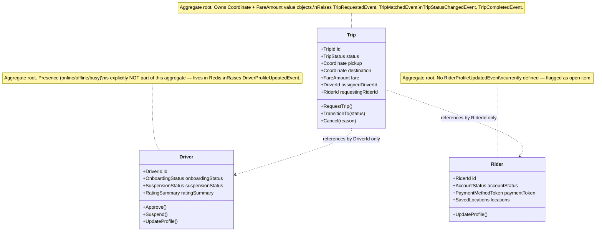
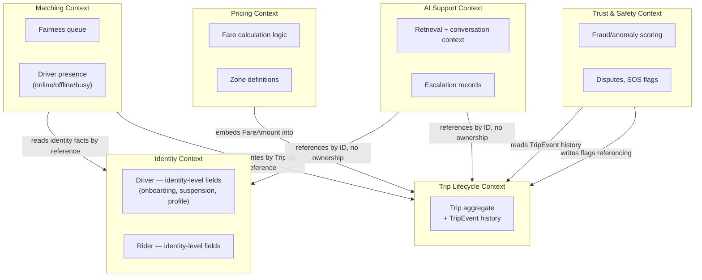
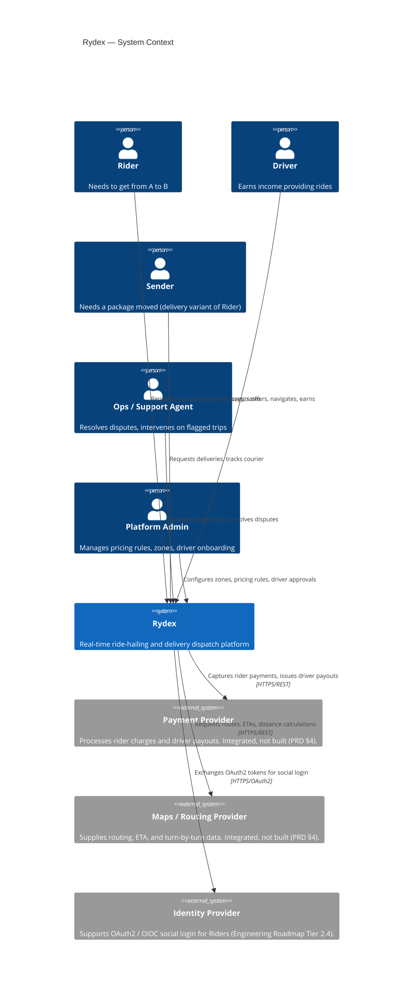
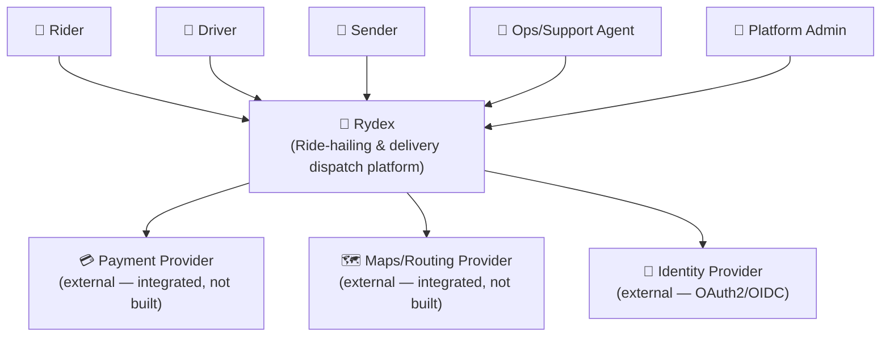
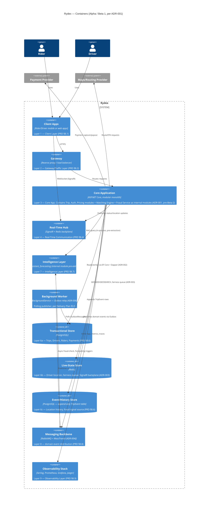
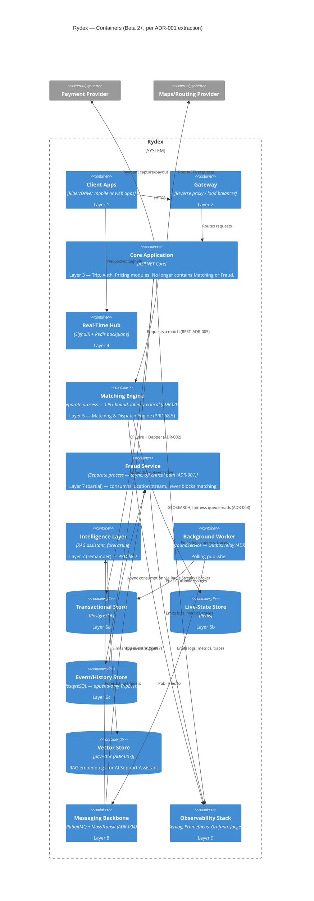
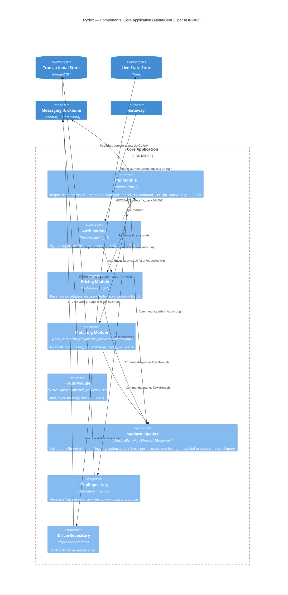
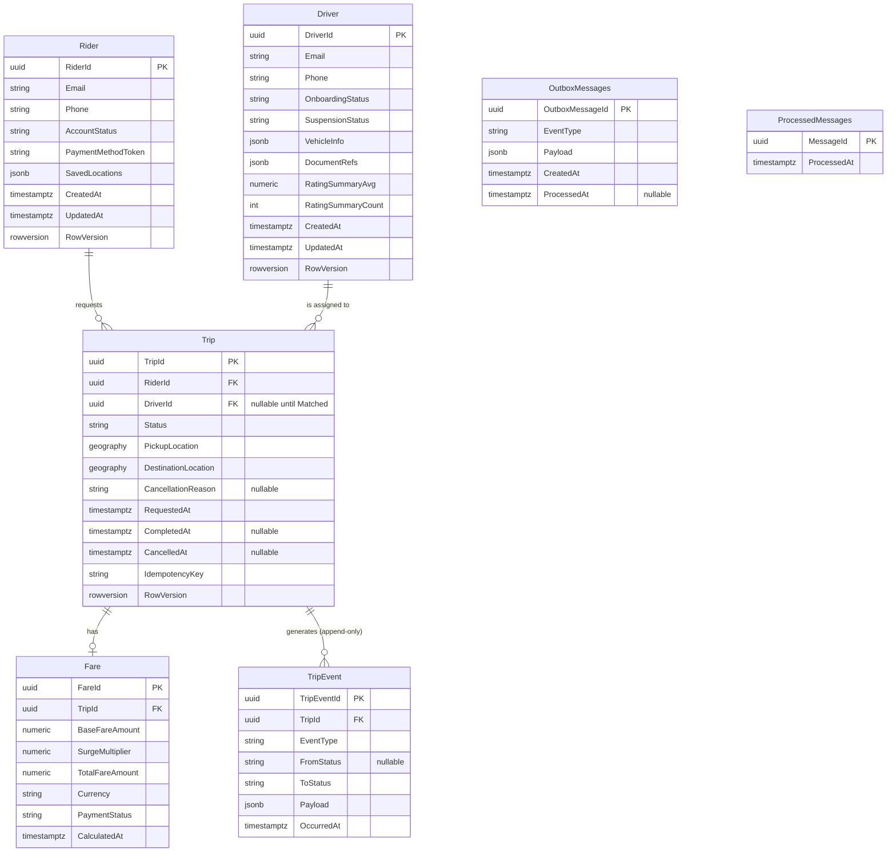
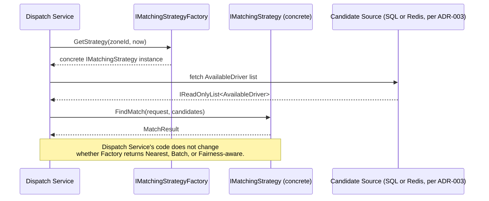

# Rydex — Domain and Architecture

> [!abstract] What this file is This is the consolidated "how it's built and why" of Rydex — the precise domain language, the DDD tactical model, every accepted architecture decision, the C4 diagrams, the database schema, and the matching engine's design. It merges twelve previously separate documents (Domain Glossary, Aggregates, Bounded Contexts, ADR-001 through ADR-007, C4 Context/Container/Component diagrams, Schema v1, and Matching Engine Design) into a single file. This is the file to open when writing code, reviewing a design, or settling a "why did we do it this way" question.
> 
> **Companion files in this set:**
> 
> - [[1.rydex-product-overview]] — vision, strategy, personas, roadmap, success metrics
> - [[2.rydex-requirements-and-risk]] — acceptance criteria, SLOs, and the risk register
> - [[4.rydex-api-contract]] — the OpenAPI v1 contract and its design notes

---

## Table of Contents

**Part J — Domain Glossary (Ubiquitous Language)** J1. The Three Questions This File Answers · J2. Core Entities & Aggregates · J3. What Is a Trip? · J4. Matched vs. Accepted · J5. Driver Identity vs. Presence · J6. Value Objects · J7. Domain Events · J8. Bounded Contexts (Preview) · J9. Open Items

**Part K — Aggregates** K1. The Three Aggregates · K2. Trip Aggregate · K3. Driver Aggregate · K4. Rider Aggregate · K5. Value Objects · K6. Domain Events Attribution · K7. Aggregate Boundary Diagram · K8. Open Items

**Part L — Bounded Contexts** L1. What a Bounded Context Decides · L2. The Six Contexts · L3. Resolving R-06 · L4. Resolving R-12 · L5. Context Boundary Diagram · L6. Cross-References · L7. Open Items

**Part M — Architecture Decision Records (ADR-001 through ADR-007)** M1. Modular Monolith vs Microservices · M2. EF Core vs Dapper · M3. Redis vs SQL for Location · M4. RabbitMQ vs Kafka · M5. REST vs gRPC · M6. Outbox Relay: Polling vs CDC · M7. pgvector vs Dedicated Vector DB

**Part N — C4 Context Diagram** N1. The Diagram · N2. Actors · N3. External Systems · N4. What's Not Shown · N5. Fallback Diagram · N6. Open Items

**Part O — C4 Container Diagram** O1. Alpha/Beta 1 State · O2. Beta 2+ State · O3. Layer-to-Container Mapping · O4. Open Items

**Part P — C4 Component Diagram (Core Application)** P1. The Diagram · P2. Module-by-Module Detail · P3. What's Not Shown · P4. Open Items

**Part Q — Database Schema v1** Q1. ERD · Q2. Table-by-Table Detail · Q3. State Machine DB Enforcement · Q4. Indexing Plan · Q5. Concurrency Strategy · Q6. Data Integrity Cross-Reference · Q7. Open Items

**Part R — Matching Engine Design** R1. The Core Interface · R2. Supporting Types · R3. NearestDriverStrategy · R4. BatchMatchingStrategy · R5. FairnessAwareStrategy · R6. Factory Pattern · R7. Sequence Diagram · R8. Open Items

---

## Part J — Domain Glossary (Ubiquitous Language)

> [!abstract] Purpose of this document Per [[3-End-to-End-Delivery-Plan|Delivery Plan]] Phase 0.2: the [[1.rydex-product-overview|product glossary]] (PRD §15-derived) is plain-language for stakeholders. Engineering needs a second, **precise** glossary — exactly what a "Trip" is, what states it can be in, the difference between "matched" and "accepted," whether a "Driver" is still a Driver when offline. This file is that glossary. It becomes the backbone of the DDD tactical model in [Aggregates (Part K above)](https://claude.ai/chat/931cc535-a10d-4882-adff-50ece26a8b63#part-k--aggregates) and [Bounded Contexts (Part L above)](https://claude.ai/chat/931cc535-a10d-4882-adff-50ece26a8b63#part-l--bounded-contexts) (Phase 1.3).

> [!important] This is ubiquitous language, not implementation detail Every term below is something a PM, an engineer, and a test writer should all mean _the same thing_ by, in conversation, code, and tests alike (per [[2-Engineering-Domain-Roadmap|Engineering Domain Roadmap]] Tier 4.6 — DDD tactical patterns). Where a term maps to an actual C# type or DB column, that's noted — but the definition itself is conceptual, not a schema dump.

## J1. The Three Questions This File Exists to Answer

Per the Delivery Plan's own framing of this file's job:

1. **What exactly is a "Trip," and what states can it be in?** → §3
2. **What's the difference between "matched" and "accepted"?** → §4
3. **Is a "Driver" still a "Driver" when offline?** → §5

Everything else in this glossary exists to support answering these three precisely.

## J2. Core Entities & Aggregates

|Term|Precise definition|
|---|---|
|**Trip**|The aggregate root (per [[2-Engineering-Domain-Roadmap|
|**Driver**|An aggregate representing a person who has completed onboarding and may be offered Trips. A Driver entity persists regardless of presence state — see §5 for the precise online/offline distinction.|
|**Rider**|An aggregate representing a person who may request Trips. Distinct from a Sender (the delivery variant), though the PRD treats Sender as a Rider sub-case rather than a separate aggregate — see [[Rydex-Product-Overview|
|**TripEvent**|An append-only domain event log entry recording one state transition of a Trip, with a timestamp. This is **not** the Trip itself — it's the audit trail _of_ the Trip, and it's also the data source fraud detection and analytics consume (per [[1-PRD|
|**Fare**|The calculated monetary value associated with a completed or in-progress Trip — base fare plus any applied surge multiplier. Distinct from **Payment**, which is the act of actually capturing that value from the Rider.|

## J3. Question 1 — What Exactly Is a Trip, and What States Can It Be In?

A Trip's lifecycle is governed by a strict state machine, enforced in **both** the domain layer and a DB constraint (per [[3-End-to-End-Delivery-Plan|Delivery Plan]] §3.2 — "not just DB constraint — both"):

```
Requested → Matched → DriverEnRoute → InProgress → Completed | Cancelled
```

|State|Precise meaning|
|---|---|
|**Requested**|A Rider has submitted pickup/destination and the system has created the Trip record. No Driver is yet associated. This is the only state a Trip can be _created_ in.|
|**Matched**|The system has selected a candidate Driver and extended them an offer. **Critically: `Matched` does not mean the Driver has accepted.** It means an offer is outstanding. See §4 below — this is precisely the ambiguity this glossary exists to remove.|
|**DriverEnRoute**|The offered Driver has accepted and is travelling to the pickup location. This is the first state where Driver commitment is confirmed, not merely offered.|
|**InProgress**|The Rider has been picked up and the Trip is actively underway toward the destination.|
|**Completed**|The Trip has reached its destination, fare has been calculated, and payment has been (or is being) captured. Terminal state.|
|**Cancelled**|The Trip was ended before reaching `Completed`, by either party, at any point from `Requested` through `InProgress`. Terminal state. A cancellation reason is always captured (per [[Rydex-Requirements-and-Risk|

> [!important] Legal transitions only A Trip can never skip a state (e.g., `Requested` directly to `InProgress`) and can never transition out of a terminal state (`Completed` or `Cancelled`). This is enforced as a constraint, not a convention — per [[2-Engineering-Domain-Roadmap|Engineering Domain Roadmap]] Tier 2.1.

> [!note] Full history vs. current state The Trip record itself stores only the _current_ state. The full history of every transition (with timestamps) lives in the separate `TripEvent` log (§2 above) — this is a deliberate modeling choice, not an oversight, because the append-only event log is what powers fraud detection and analytics without bloating the Trip aggregate itself.

## J4. Question 2 — What's the Difference Between "Matched" and "Accepted"?

This is the single most important distinction in the entire glossary, and the Delivery Plan calls it out by name as something engineering must not be ambiguous about.

**"Matched" is a Trip-level state.** It means: _the dispatch system has identified a candidate Driver and extended them an offer._ It says nothing about whether that Driver has responded yet.

**"Accepted" is a Driver-level action**, not a Trip state in its own right. It's the event that causes a `Matched` Trip to transition to `DriverEnRoute`. There is no `Accepted` value in the `TripStatus` enum — acceptance is the _trigger_, `DriverEnRoute` is the _result_.

This distinction exists because of how the system actually behaves under the hood, per the trip-lifecycle saga (per [[2-Engineering-Domain-Roadmap|Engineering Domain Roadmap]] Tier 3.2 and Tier 2.6's "Saga pattern" note):

|Step|What's actually happening|Trip status during this step|
|---|---|---|
|1|`TripRequestedEvent` fires; matching attempts to find a Driver|`Requested`|
|2|A candidate Driver is selected; an offer is extended|`Matched`|
|3a|The Driver **accepts** within the timeout window (30 seconds)|Transitions to `DriverEnRoute`|
|3b|The Driver **does not respond** within the timeout, or **declines**|The saga **compensates** — releases the reservation on that Driver and retries the next-best candidate. The Trip _remains_ (or returns to) `Matched` against a new candidate.|

> [!warning] Why this matters in code and in conversation If an engineer writes `if (trip.Status == TripStatus.Matched)` intending "the Driver has confirmed," that's a bug — `Matched` includes the window where the offer is still pending or has just been re-offered to someone else after a decline. The only state that confirms Driver commitment is `DriverEnRoute`. Anyone on the team saying "the trip is matched" in conversation should mean "an offer is out," not "it's locked in" — and should say "the driver accepted" or "the trip is en route" when they mean the latter.

## J5. Question 3 — Is a Driver Still a Driver When Offline?

**Yes — unambiguously.** "Driver" is an identity/aggregate (§2), not a presence state. A Driver who has gone offline, or who has never gone online since onboarding, is still the same Driver entity, with the same `DriverId`, the same profile, the same Trip history.

What changes when a Driver goes offline is their **presence**, a separate, transient attribute layered on top of the Driver identity (per [[1-PRD|PRD]] Epic C — "Driver presence (online/offline/busy)"):

|Presence value|Precise meaning|
|---|---|
|**Online**|The Driver has actively opted in to receive ride offers; their live location is being tracked.|
|**Offline**|The Driver exists but is not currently eligible for matching; no live location is being tracked for them.|
|**Busy**|The Driver is online (connected, trackable) but currently committed to an active Trip (`DriverEnRoute` or `InProgress`) and therefore not eligible for _new_ offers.|

> [!note] Why presence is modeled separately from identity Presence data lives in Redis with TTL-based expiry (per [[2-Engineering-Domain-Roadmap|Engineering Domain Roadmap]] Tier 2.3 — "driver presence keys expire automatically"), specifically because it's fast-changing and disposable — losing a presence key on a crash is acceptable (the Driver simply needs to reconnect), whereas losing the Driver identity record itself would be a data-integrity incident. Modeling them as the same thing would force identity data into the same volatile, expiring store as presence data, which the architecture explicitly avoids (per [[1-PRD|PRD]] §8's Data Layer rationale — different stores for different correctness/speed needs).

> [!important] Practical implication for the "Driver still a Driver when offline" question A Driver's Trip history, ratings, payout records, and account status are **never** affected by presence. Only their _eligibility for new matching_ changes. This means, for example, that a suspended Driver (Driver management, Epic I) is a different concept entirely from an offline Driver — suspension is an identity-level state (who can use the platform at all), while offline is a presence-level state (who's currently reachable for an offer). The two are easy to conflate in casual conversation but must never be conflated in code or in the authorization logic that checks them.

## J6. Value Objects (Strongly-Typed Primitives)

Per [[2-Engineering-Domain-Roadmap|Engineering Domain Roadmap]] Tier 1.2, these exist specifically to prevent primitive types (raw strings, raw decimals) from being used where a precise domain concept is meant — using a raw `Guid` for both a `TripId` and a `DriverId`, for instance, would let one be passed where the other is expected without the compiler catching it.

|Term|Precise definition|
|---|---|
|**TripId**|A strongly-typed identifier for a Trip. Never interchangeable with DriverId or RiderId, even though all three may be backed by a `Guid` underneath.|
|**DriverId**|A strongly-typed identifier for a Driver.|
|**Coordinate**|A value object representing a WGS84 latitude/longitude pair. Immutable — a new Coordinate is created for each location update, not mutated in place, since location pings are a stream of distinct facts, not an evolving single fact.|
|**FareAmount**|A strongly-typed monetary value representing a calculated fare. Distinguished from a raw `decimal` specifically so fare-calculation code can't accidentally treat it as, say, a distance or a duration.|

## J7. Domain Events

Domain events are the precise, named facts published when a Trip (or Driver) transitions state. Per [[2-Engineering-Domain-Roadmap|Engineering Domain Roadmap]] Tier 1.3, these are what downstream consumers (notifications, fraud checks, receipts) react to — the event _is_ the ubiquitous-language name for "this specific thing just happened."

|Event|Precisely fires when|
|---|---|
|**TripRequestedEvent**|A Trip is created in `Requested` state.|
|**TripMatchedEvent**|A Driver has been offered the Trip (Trip enters `Matched`). **Does not mean accepted** — see §4.|
|**TripStatusChangedEvent**|Any Trip status transition occurs. This is the general-purpose event the real-time status push (Epic C) consumes; it's deliberately on a different reliability tier than location pings (must-not-lose, vs. location's lossy-acceptable tier — per [[2-Engineering-Domain-Roadmap|
|**TripCompletedEvent**|A Trip transitions to `Completed`. Triggers receipt generation and payout calculation.|
|**DriverProfileUpdatedEvent**|A Driver's profile data changes — used specifically to invalidate cached Driver data (per [[2-Engineering-Domain-Roadmap|

## J8. Bounded Contexts (Preview)

Per [[3-End-to-End-Delivery-Plan|Delivery Plan]] §1.3, Rydex is divided into six bounded contexts, each with a clear data-ownership boundary. This glossary doesn't define the contexts in full — that's [Bounded Contexts (Part L above)](https://claude.ai/chat/931cc535-a10d-4882-adff-50ece26a8b63#part-l--bounded-contexts)'s job — but flags here which terms belong to which context, since a term can mean something subtly different depending on which context is using it:

|Bounded Context|Owns these terms|
|---|---|
|**Identity**|Driver (identity-level), Rider, role/authorization concepts|
|**Trip Lifecycle**|Trip, TripStatus, TripEvent, cancellation, Fare (the record, not the calculation logic)|
|**Matching**|Matched state transition, offer/accept/decline, the matching saga, fairness queue|
|**Pricing**|Fare calculation logic, surge multiplier, Zone|
|**Trust & Safety**|Fraud flag, dispute, SOS|
|**AI Support**|Retrieval, escalation, conversation context|

> [!warning] Driver presence spans two contexts, which is a known modeling tension Driver _identity_ belongs to the Identity context. Driver _presence_ (online/offline/busy) is operationally closest to the Matching context, since that's who consumes it. [Bounded Contexts (Part L above)](https://claude.ai/chat/931cc535-a10d-4882-adff-50ece26a8b63#part-l--bounded-contexts) needs to make an explicit call on which context owns the presence attribute — this glossary flags the tension rather than resolving it, since resolving it is that file's job, not this one's.

## J9. Open Items Surfaced by This Pass

1. **Driver presence's bounded-context ownership is unresolved** (§8) — carry into [Bounded Contexts (Part L above)](https://claude.ai/chat/931cc535-a10d-4882-adff-50ece26a8b63#part-l--bounded-contexts) as a decision to make explicitly, not by default.
2. **Sender is not modeled as its own aggregate** — it's treated as a Rider sub-case throughout this glossary, consistent with [[1.rydex-product-overview|personas]]'s flagged scope gap. If a future PRD revision gives Sender genuinely distinct lifecycle states (e.g., proof-of-delivery as a terminal sub-state), this glossary's Trip state machine in §3 would need revisiting, since the current `Requested → ... → Completed` sequence has no delivery-specific state.
3. **"Matched" as a Trip status is overloaded** in casual team conversation per §4's warning — this isn't a gap in the model, but a recommended team practice: prefer saying "offer extended" vs. "driver accepted" in standups and PR descriptions, reserving "matched" for the precise Trip-status sense only. -e

---

## Part K — Aggregates

> [!abstract] Purpose of this document Per [[3-End-to-End-Delivery-Plan|Delivery Plan]] §1.3: this file specifies the DDD tactical design — aggregates, their boundaries and invariants, the value objects attached to them, and the domain events they raise. [Domain Glossary (Part J above)](https://claude.ai/chat/931cc535-a10d-4882-adff-50ece26a8b63#part-j--domain-glossary-ubiquitous-language) already defined _what these terms mean_; this file defines _how they're structured and what each one is responsible for protecting_. [Bounded Contexts (Part L above)](https://claude.ai/chat/931cc535-a10d-4882-adff-50ece26a8b63#part-l--bounded-contexts) (next in sequence) defines which of the six contexts owns each aggregate.

> [!important] What "aggregate" means here, precisely An aggregate is a cluster of objects treated as a single unit for data changes, with one designated **aggregate root** as the only entry point external code is allowed to use. Per [[2-Engineering-Domain-Roadmap|Engineering Domain Roadmap]] Tier 4.6, this is what makes invariants enforceable — nothing outside the aggregate can reach into it and put it in an invalid state, because nothing outside the aggregate has a reference to its internals, only to the root.

## K1. The Three Aggregates, At a Glance

Per [[3-End-to-End-Delivery-Plan|Delivery Plan]] §1.3, exactly three aggregates exist in Rydex's domain model:

|Aggregate|Root|Why it's an aggregate root, not just an entity|
|---|---|---|
|**Trip**|`Trip`|Owns the state machine ([Domain Glossary (Part J above)](https://claude.ai/chat/931cc535-a10d-4882-adff-50ece26a8b63#part-j--domain-glossary-ubiquitous-language) §3) and is the one object every transition must pass through — no other code may move a Trip from `Matched` to `DriverEnRoute` except the Trip aggregate's own method enforcing that the transition is legal|
|**Driver**|`Driver`|Owns identity-level invariants (§5 below) that must hold regardless of presence state — onboarding status, suspension status, document verification|
|**Rider**|`Rider`|Owns identity-level invariants for the rider side — account status, saved payment method references, saved locations|

> [!note] Why only three, and not more Fare, TripEvent, and presence state are deliberately **not** aggregate roots in their own right. Fare is a value object/child of Trip (§3 below). TripEvent is an append-only log entry, not something with its own lifecycle to protect. Presence is Redis-backed transient state, not a domain entity at all (per [Domain Glossary (Part J above)](https://claude.ai/chat/931cc535-a10d-4882-adff-50ece26a8b63#part-j--domain-glossary-ubiquitous-language) §5) — modeling it as an aggregate would wrongly imply it has identity-level durability guarantees it deliberately doesn't have.

## K2. Trip Aggregate

### What it contains

- **Root:** `Trip` — identified by `TripId` (value object, §6)
- **Owned/contained:** the current `TripStatus`, a `Coordinate` for pickup, a `Coordinate` for destination, a reference to the assigned `DriverId` (once matched — a reference only, not the Driver aggregate itself), a reference to the requesting `RiderId`, an embedded `Fare` (calculated, not a separate aggregate)
- **Referenced by ID only, never embedded:** `Driver`, `Rider` — per the rule that aggregates reference each other by ID, never by direct object reference, to keep transaction boundaries small and avoid one aggregate's save accidentally cascading into another's

### Invariants this aggregate must enforce

1. **State transitions are legal only in the defined sequence** (per [Domain Glossary (Part J above)](https://claude.ai/chat/931cc535-a10d-4882-adff-50ece26a8b63#part-j--domain-glossary-ubiquitous-language) §3) — `Requested → Matched → DriverEnRoute → InProgress → Completed | Cancelled`. The Trip aggregate's own transition method is the only code path allowed to change `TripStatus`; nothing external sets the status directly.
2. **A Trip cannot be `Matched` without an assigned `DriverId`**, and cannot be `DriverEnRoute` without that same Driver having explicitly accepted (per [Domain Glossary (Part J above)](https://claude.ai/chat/931cc535-a10d-4882-adff-50ece26a8b63#part-j--domain-glossary-ubiquitous-language) §4's Matched-vs-Accepted distinction) — the aggregate is the thing responsible for refusing an invalid combination of status + driver assignment.
3. **A Trip in a terminal state (`Completed` or `Cancelled`) is immutable** — no further state transitions, no further Fare recalculation.
4. **Cancellation always captures a reason** (per [[2.rydex-requirements-and-risk|traceability matrix]] §3) — the aggregate's cancel method requires a reason parameter; there's no code path to cancel without one.

### Domain events raised

Per [Domain Glossary (Part J above)](https://claude.ai/chat/931cc535-a10d-4882-adff-50ece26a8b63#part-j--domain-glossary-ubiquitous-language) §7 — `TripRequestedEvent` (on creation), `TripMatchedEvent` (on entering `Matched` — explicitly does not mean accepted), `TripStatusChangedEvent` (on any transition), `TripCompletedEvent` (on reaching `Completed`).

> [!warning] The aggregate boundary is exactly where the Matched/Accepted ambiguity (domain/glossary.md §4) must be enforced in code, not just documented Because `Matched` can mean "offer outstanding" and the saga may retry against a new Driver candidate after a decline, the Trip aggregate's transition logic — not the saga, not the matching engine — is the single place that must correctly track which `DriverId` the _current_ outstanding offer is against. If that bookkeeping lived outside the aggregate, a race between a late acceptance from a previous candidate and a new offer to the next candidate could corrupt the Trip's state. Keeping it inside the aggregate boundary is what makes this invariant enforceable at all.

## K3. Driver Aggregate

### What it contains

- **Root:** `Driver` — identified by `DriverId` (value object, §6)
- **Owned/contained:** profile data, vehicle info, document references (per [[1-PRD|PRD]] Epic A — "simulated verification"), onboarding status (pending / approved / rejected), suspension status, rating history (aggregate-level summary, not the individual Rating records themselves — see note below)
- **Explicitly not contained:** presence state (online/offline/busy). Per [Domain Glossary (Part J above)](https://claude.ai/chat/931cc535-a10d-4882-adff-50ece26a8b63#part-j--domain-glossary-ubiquitous-language) §5, presence is modeled separately — Redis-backed, TTL-expiring, deliberately _not_ part of this aggregate's persisted state, since losing it on a crash is an acceptable, recoverable event, unlike losing anything else in this aggregate.

### Invariants this aggregate must enforce

1. **A Driver cannot be eligible for matching unless onboarding status is `Approved`** — this is the precise mechanism behind [[2.rydex-requirements-and-risk|traceability matrix]] §2's acceptance criterion that an unapproved Driver attempting to go online is blocked.
2. **A suspended Driver is immediately ineligible for new matches**, regardless of any in-progress trip being allowed to complete (per [[2.rydex-requirements-and-risk|traceability matrix]] §10) — suspension and "currently has an active trip" are independent facts the aggregate must be able to hold simultaneously without contradiction.
3. **Identity-level facts never change due to presence** (per [Domain Glossary (Part J above)](https://claude.ai/chat/931cc535-a10d-4882-adff-50ece26a8b63#part-j--domain-glossary-ubiquitous-language) §5's "still a Driver when offline" framing) — there is no code path by which going offline alters onboarding status, suspension status, or Trip history.

### Domain events raised

`DriverProfileUpdatedEvent` (per [Domain Glossary (Part J above)](https://claude.ai/chat/931cc535-a10d-4882-adff-50ece26a8b63#part-j--domain-glossary-ubiquitous-language) §7) — fired specifically to support cache invalidation (per [[2-Engineering-Domain-Roadmap|Engineering Domain Roadmap]] Tier 3.6) when profile data changes.

> [!note] Why rating history is a summary here, not the Ratings & Feedback feature's actual records The individual Rating a Rider leaves after a Trip (per [[2.rydex-requirements-and-risk|traceability matrix]] §3) belongs conceptually to the Trip it was given on, not to the Driver aggregate directly. The Driver aggregate holds a _derived summary_ (e.g., an average), updated asynchronously when new ratings arrive — keeping individual Rating records out of the Driver aggregate's transactional boundary, consistent with the general DDD guidance of keeping aggregates small.

## K4. Rider Aggregate

### What it contains

- **Root:** `Rider` — no dedicated strongly-typed ID value object is named in the Delivery Plan's brief (only `DriverId` and `TripId` are explicitly listed — see §6's open item below)
- **Owned/contained:** account status, saved payment method reference (a token reference to the Payment Provider, per [C4 Context Diagram (Part N above)](https://claude.ai/chat/931cc535-a10d-4882-adff-50ece26a8b63#part-n--c4-context-diagram) §3 — never raw card data, per [[2.rydex-requirements-and-risk|SLO definitions]] §7), saved locations, ride preferences

### Invariants this aggregate must enforce

1. **A Rider's saved payment method is always a provider-issued token reference, never raw card data** — this invariant is what makes the Security & Privacy SLO (zero raw card storage) actually true at the data-model level, not just true as a stated intention.
2. **Profile and preference updates are immediately reflected** in subsequent actions (per [[2.rydex-requirements-and-risk|traceability matrix]] §2) — e.g., a newly saved location pre-fills the next trip request.

### Domain events raised

None named explicitly in the Delivery Plan's brief for Rider specifically — **flagged as an open item below**, since Driver gets `DriverProfileUpdatedEvent` but no equivalent `RiderProfileUpdatedEvent` is named, despite Rider profile updates being a stated feature (Epic A).

## K5. Value Objects and Which Aggregate(s) They Attach To

Per [[2-Engineering-Domain-Roadmap|Engineering Domain Roadmap]] Tier 1.2 and [Domain Glossary (Part J above)](https://claude.ai/chat/931cc535-a10d-4882-adff-50ece26a8b63#part-j--domain-glossary-ubiquitous-language) §6, four value objects are named:

|Value Object|Attaches to|Role|
|---|---|---|
|**TripId**|Trip (as its identity)|Strongly-typed identifier — never interchangeable with DriverId, even though both may be backed by a `Guid`|
|**DriverId**|Driver (as its identity)|Strongly-typed identifier|
|**Coordinate**|Trip (pickup, destination)|Immutable WGS84 lat/lng pair — a new Coordinate is created per location fact, never mutated in place|
|**FareAmount**|Trip (embedded Fare)|Strongly-typed monetary value, distinguished from a raw `decimal` so fare-calculation code can't accidentally substitute a distance or duration value|

> [!important] Open item — no RiderId value object is named in the source brief The Delivery Plan's §1.3 brief lists `Coordinate`, `FareAmount`, `DriverId`, `TripId` — but not `RiderId`, despite Rider being one of the three named aggregates. This is almost certainly an oversight in the original brief rather than a deliberate decision (there's no reasoning anywhere in the PRD or Engineering Roadmap suggesting Rider identity should be a raw `Guid` while Driver identity is strongly-typed). **Recommended action:** treat `RiderId` as an implied fourth value object, parallel to `DriverId`, and flag this correction explicitly here rather than silently adding it without comment.

## K6. Domain Events — Aggregate Attribution

|Event|Raised by|Fires when|
|---|---|---|
|**TripRequestedEvent**|Trip|Created in `Requested` state|
|**TripMatchedEvent**|Trip|Enters `Matched` (offer extended — not necessarily accepted, per [Domain Glossary (Part J above)](https://claude.ai/chat/931cc535-a10d-4882-adff-50ece26a8b63#part-j--domain-glossary-ubiquitous-language) §4)|
|**TripCompletedEvent**|Trip|Reaches `Completed`|
|**DriverProfileUpdatedEvent**|Driver|Profile data changes|

> [!note] TripStatusChangedEvent is in domain/glossary.md but not the Delivery Plan's §1.3 list [Domain Glossary (Part J above)](https://claude.ai/chat/931cc535-a10d-4882-adff-50ece26a8b63#part-j--domain-glossary-ubiquitous-language) §7 names `TripStatusChangedEvent` as a fifth event (the general-purpose one the real-time status push consumes), but the Delivery Plan's §1.3 brief only lists four events total. This isn't a contradiction — `TripStatusChangedEvent` is reasonably understood as the general case that fires on _every_ transition, while `TripRequestedEvent`/`TripMatchedEvent`/`TripCompletedEvent` are specific, semantically-named instances fired at particular transitions, possibly _in addition to_ the general event. **This file treats domain/glossary.md's five-event list as authoritative**, since it's the more complete and more recently reasoned-through of the two, but flags the discrepancy rather than silently picking one source over the other without saying so.

## K7. Aggregate Boundary Diagram



## K8. Open Items Surfaced by This Pass

1. **RiderId is not named as a value object in the Delivery Plan's source brief**, despite Rider being a named aggregate (§5) — treated here as an implied correction, not a silent addition.
2. **No RiderProfileUpdatedEvent is named**, despite Rider profile updates being a real feature (Epic A) and Driver having a parallel event — flagged in §4 and §6 as a likely gap in the original domain-event list.
3. **TripStatusChangedEvent's relationship to the other three Trip events is implicit, not explicit**, in the source material — this file resolves it by treating [Domain Glossary (Part J above)](https://claude.ai/chat/931cc535-a10d-4882-adff-50ece26a8b63#part-j--domain-glossary-ubiquitous-language)'s fuller five-event list as authoritative (§6), but the underlying ambiguity in the Delivery Plan's brief is worth a deliberate confirmation at the next architecture review.
4. **Rating's aggregate ownership (§3 note)** — treating it as logically attached to Trip rather than Driver is this file's own reasoned judgment call, not something explicitly stated anywhere in the source documents. Worth confirming against [Bounded Contexts (Part L above)](https://claude.ai/chat/931cc535-a10d-4882-adff-50ece26a8b63#part-l--bounded-contexts) once written. -e

---

## Part L — Bounded Contexts

> [!abstract] Purpose of this document Per [[3-End-to-End-Delivery-Plan|Delivery Plan]] §1.3: six bounded contexts — Identity, Trip Lifecycle, Matching, Pricing, Trust & Safety, AI Support — each with a clear data-ownership boundary (per [[2-Engineering-Domain-Roadmap|Engineering Domain Roadmap]] Tier 3.3). This file draws those boundaries explicitly, decides which aggregate and which ambiguous attribute belongs to which context, and **closes two risks deliberately deferred here**: [[2.rydex-requirements-and-risk|risk register]] R-06 (Driver onboarding/management coupling) and R-12 (Driver presence ownership).

> [!important] Exit criteria this file satisfies Per [[3-End-to-End-Delivery-Plan|Delivery Plan]]'s overall Phase 1 exit bar, every ADR must have a decision, not a "TBD." The same standard applies here: every bounded-context boundary below is a stated decision with reasoning, not a default inherited from whichever document happened to mention a term first.

## L1. What a Bounded Context Decides

Per [[2-Engineering-Domain-Roadmap|Engineering Domain Roadmap]] Tier 3.3, a bounded context is a **data-ownership boundary** — it decides which part of the system is the single source of truth for a given concept, and which parts of the system merely _reference_ that concept by ID without owning it. Two contexts can both talk about "a Driver," but only one context owns what a Driver record actually contains; everywhere else, a Driver is a reference, not a fact.

This matters because Rydex's data layer is already split by _performance characteristics_ ([ADR-003 (Part M3 above)](https://claude.ai/chat/931cc535-a10d-4882-adff-50ece26a8b63#m3-adr-003-redis-as-system-of-record-for-live-location-vs-sql) — Redis vs. SQL), which is a different axis than bounded contexts' split by _domain meaning_. A single technical store (e.g., Redis) can hold data owned by more than one bounded context — this file is where that's made explicit rather than left to be inferred from infrastructure alone.

## L2. The Six Bounded Contexts

|Context|Owns|Primary aggregate(s)|
|---|---|---|
|**Identity**|Rider and Driver identity-level facts: account existence, role, authentication, onboarding/suspension status|Driver, Rider (identity-level fields only)|
|**Trip Lifecycle**|The Trip aggregate and its state machine, TripEvent history|Trip|
|**Matching**|The act of finding and offering a Driver to a Trip; the fairness queue; driver presence (resolved below, §4)|None of its own — reads Trip (by ID), reads Driver presence|
|**Pricing**|Fare calculation logic, surge multiplier, Zone definitions|None of its own — embeds FareAmount into Trip via Trip Lifecycle|
|**Trust & Safety**|Fraud/anomaly scoring, disputes, SOS flags|None of its own — reads TripEvent history, writes flags referencing Trip by ID|
|**AI Support**|Retrieval, conversation context, escalation state|None of its own — reads policy documents, writes escalation records referencing Rider/Driver by ID|

> [!note] Why Matching, Pricing, Trust & Safety, and AI Support have no aggregate of their own Per [Aggregates (Part K above)](https://claude.ai/chat/931cc535-a10d-4882-adff-50ece26a8b63#part-k--aggregates) §1, only three aggregates exist in the entire domain model: Trip, Driver, Rider. The other four contexts are real data-ownership boundaries, but they operate _on_ those three aggregates (or on derived, non-aggregate data like fraud scores and fairness-queue state) rather than owning aggregates of their own. This is consistent with [[1-PRD|PRD]] §8's framing of Matching as "a specialized decision-making component" — decision-making, not a separate system of record.

## L3. Resolving R-06 — Driver Onboarding and Driver Management's Mutual Dependency

> [!warning] Risk being resolved [[2.rydex-requirements-and-risk|risk register]] R-06: Driver onboarding (Epic A) and Driver management's approval step (Epic I) depend on each other in a way that doesn't fit a clean one-directional Epic dependency — an approval action touches both.

**Decision: Driver onboarding and Driver management's approval/suspension actions both belong to the Identity context, as a single data-ownership boundary.**

**Reasoning:** Epic A (onboarding) and Epic I (Admin Console's driver approval/suspension) were drawn as separate _product_ Epics because they serve different personas (Driver self-service vs. Admin oversight, per [[1.rydex-product-overview|personas]] §2, §5) — but a product Epic boundary and a bounded-context boundary answer different questions. The Epic boundary is about _who initiates an action_; the bounded-context boundary is about _who owns the resulting data_. Onboarding status, approval status, and suspension status are all the same underlying fact about a Driver's identity-level eligibility — there's no genuine data split here, only a difference in which persona triggers a transition.

**What this resolves concretely:** an approval action is now a single transactional operation within one bounded context (Identity), not a cross-context operation requiring eventual consistency or a coordinating saga. [[2.rydex-requirements-and-risk|traceability matrix]] §10's note that these "should be treated as a single deliverable for sequencing purposes" is hereby confirmed at the architecture level, not just the planning level.

**What remains a genuine cross-context relationship:** the Admin Console's _UI_ for triggering approval/suspension is a different concern from where the _data_ lives — Admin Console (Epic I) is a consumer of the Identity context's capabilities, not a separate owner of overlapping data. This distinction is what keeps the decision clean: Admin Console calls into Identity; it doesn't duplicate Identity's state.

## L4. Resolving R-12 — Driver Presence's Bounded-Context Ownership

> [!warning] Risk being resolved [[2.rydex-requirements-and-risk|risk register]] R-12: Driver _identity_ belongs to Identity; Driver _presence_ (online/offline/busy) is operationally closest to Matching, since that's who consumes it. No explicit decision had been made.

**Decision: Driver presence is owned by the Matching context, as a read-and-write concern, with Identity remaining the source of truth for the Driver record itself.**

**Reasoning:**

1. **Consumption pattern.** Per [[2-Engineering-Domain-Roadmap|Engineering Domain Roadmap]] Tier 2.3, presence is read constantly and exclusively by the matching/dispatch flow (`GEOSEARCH` against online drivers, fairness-queue eligibility checks) — Identity has no operational reason to read presence at all.
2. **Durability mismatch with Identity's other data.** Per [Aggregates (Part K above)](https://claude.ai/chat/931cc535-a10d-4882-adff-50ece26a8b63#part-k--aggregates) §3, presence is explicitly excluded from the Driver aggregate precisely because it's Redis-backed, TTL-expiring, acceptable-to-lose data — a fundamentally different durability posture than onboarding/suspension status, which must never be lost. Folding presence into Identity's ownership would force Identity to either accept a weaker durability guarantee for some of its data, or maintain two different consistency postures within one context — both worse than giving presence its own home in the context that actually needs it operationally.
3. **This was already implicit in the Container diagram.** [C4 Container Diagram (Part O above)](https://claude.ai/chat/931cc535-a10d-4882-adff-50ece26a8b63#part-o--c4-container-diagram) already shows the Live-State Store (Redis) being read/written by the Matching Engine, not by a separate Identity-owned service — this decision makes that existing diagram's implicit choice explicit and intentional rather than accidental.

**What this resolves concretely:** "Is a Driver still a Driver when offline?" ([Domain Glossary (Part J above)](https://claude.ai/chat/931cc535-a10d-4882-adff-50ece26a8b63#part-j--domain-glossary-ubiquitous-language) §5) now has an architectural answer, not just a conceptual one — yes, because Identity (which says so) never reads presence at all; presence is purely Matching's concern, layered on top of an Identity-owned Driver reference.

**Boundary consequence worth naming explicitly:** Matching now reads Driver _identity_ facts (is this Driver approved? suspended?) by ID-reference into Identity, while owning presence directly. This means a Driver going offline never touches Identity's data, and a Driver being suspended (Identity's data) must be checked by Matching before extending a new offer — this is a cross-context read Matching must perform, not a duplicated copy of suspension status living in two places.

## L5. Context Boundary Diagram



## L6. Context-by-Context Cross-References

|Context|Reads from (by reference only)|Writes|
|---|---|---|
|**Identity**|Nothing external|Driver/Rider identity fields|
|**Trip Lifecycle**|Identity (Driver/Rider exist and are eligible)|Trip aggregate, TripEvent log|
|**Matching**|Identity (suspension/approval check), Trip Lifecycle (Trip exists, is Requested)|Driver presence, fairness queue, TripMatchedEvent trigger|
|**Pricing**|Trip Lifecycle (Trip pickup/destination)|FareAmount (embedded back into Trip via Trip Lifecycle's own write path — Pricing does not write directly into the Trip aggregate)|
|**Trust & Safety**|Trip Lifecycle (TripEvent stream, async)|Fraud flags, disputes (reference Trip by ID)|
|**AI Support**|Identity, Trip Lifecycle (conversation context only — no write access to either)|Escalation records|

> [!important] Pricing never writes directly into the Trip aggregate This is a subtle but important boundary: per [Aggregates (Part K above)](https://claude.ai/chat/931cc535-a10d-4882-adff-50ece26a8b63#part-k--aggregates) §2, FareAmount is embedded _in_ the Trip aggregate, but per the Trip aggregate's own invariant enforcement, only Trip Lifecycle's code is allowed to mutate the Trip aggregate's state. Pricing calculates a FareAmount and hands it to Trip Lifecycle, which is the one that actually persists it as part of a Trip state transition — Pricing context does not have direct write access to the Trip aggregate's table. This is what keeps Trip's invariants (§2 of aggregates.md) enforceable regardless of which context triggered the change.

## L7. Open Items Surfaced by This Pass

1. **R-06 and R-12 are now resolved** — both decisions (§3, §4) are stated with explicit reasoning. Update [[2.rydex-requirements-and-risk|risk register]]'s status column for these two rows to reflect resolution once this file is reviewed and accepted.
2. **Admin Console's bounded-context home is still not fully settled** — per [C4 Component Diagram (Part P above)](https://claude.ai/chat/931cc535-a10d-4882-adff-50ece26a8b63#part-p--c4-component-diagram-core-application) §4's open item, Admin Console's container-level placement was already flagged as undecided. This file's §3 resolution clarifies that Admin Console _consumes_ Identity's capabilities rather than owning overlapping data, but doesn't resolve whether Admin Console is its own container or a Core App sub-module — that's still an open architecture question, now narrowed but not closed.
3. **AI Support's read-only relationship to Identity and Trip Lifecycle** assumes the content-ownership gap from [[2.rydex-requirements-and-risk|risk register]] R-10 gets resolved — this context diagram shows AI Support reading conversation context, but the underlying policy documents it retrieves from still have no confirmed owner, independent of this file's bounded-context boundaries being otherwise sound. -e

---

## Part M — Architecture Decision Records

> [!important] How to read the ADRs in this part Each ADR follows the same lightweight template: Context, Decision, Consequences, Alternatives Considered. Sub-numbers (e.g. M1.1, M1.2) correspond to these four sections within each ADR.

## M1. ADR-001: Modular Monolith vs Microservices from Day One

> [!abstract] Status **Accepted.** Per [[3-End-to-End-Delivery-Plan|Delivery Plan]] §1.1.

### M1.1 Context

Rydex needs to decide its service topology before any production code is written. The two extremes — a single monolith with no internal boundaries, or a full microservices architecture from day one — both carry known failure modes: the former tends toward an unmaintainable "ball of mud" as features accumulate; the latter imposes distributed-systems complexity (network calls, partial failure, eventual consistency) before the team has even validated which parts of the system actually need to scale independently.

[[2-Engineering-Domain-Roadmap|Engineering Domain Roadmap]] Tier 3.3 frames the real question precisely: _what is one service vs two?_ The Matching Engine has a fundamentally different scaling profile than the rest of the application — CPU-bound, latency-critical decisions, versus the Core Application's IO-bound CRUD work. The Fraud Service is separate for a different reason: a slow fraud check must never be allowed to block a rider's matching request. **The deciding factor is scaling profile and failure isolation, not org chart convenience or "microservices are the modern way" reasoning.**

### M1.2 Decision

**Modular monolith for Alpha and Beta 1.** All bounded contexts (Identity, Trip Lifecycle, Matching, Pricing, Trust & Safety, AI Support — per [[3-End-to-End-Delivery-Plan|Delivery Plan]] §1.3) live in one deployable unit, with strict internal module boundaries enforced by Clean Architecture layering and vertical-slice organization (per [[2-Engineering-Domain-Roadmap|Engineering Domain Roadmap]] Tier 4.6).

**Starting Beta 2, the Matching Engine and Fraud Service are carved out as separate processes.** This timing is deliberate, not arbitrary: Beta 2 is the first point where Matching's CPU-bound, latency-critical profile genuinely diverges from the rest of the system under realistic load (batch matching, fairness queueing), and Beta 3 is when Fraud Service's async, off-critical-path nature becomes load-bearing (per [[1.rydex-product-overview|feature roadmap]] §5, §6).

### M1.3 Consequences

**Positive:**

- Alpha and Beta 1 avoid premature distributed-systems complexity — no network calls, no partial-failure handling, no service-discovery overhead while the core domain model is still being proven out
- The eventual extraction points (Matching, Fraud) are decided in advance, so the modular monolith's internal boundaries can be drawn _in anticipation_ of that future split — module boundaries become process boundaries later, rather than requiring a redesign
- Matches the explicit reasoning the engineering roadmap already gives: services are separated by scaling profile, which means the extraction timing is justified by evidence (Beta 2/3's actual load characteristics), not by milestone-number coincidence

**Negative / costs accepted:**

- Until Beta 2, a slow matching computation _could_ theoretically compete for resources with unrelated Core App work in the same process — acceptable at Alpha/Beta 1 scale, but this is exactly the constraint that motivates the Beta 2 extraction
- The extraction itself (Beta 2) is real engineering work that must be planned for, not deferred indefinitely — this ADR commits the team to doing it at a specific point, which is a schedule dependency the [[3-End-to-End-Delivery-Plan|Delivery Plan]]'s Phase 5.1 already accounts for

### M1.4 Alternatives Considered

**Microservices from day one.** Rejected because it would impose distributed-systems failure modes (network partitions, eventual consistency, service-to-service auth) before the domain model is stable enough to know where the _correct_ service boundaries actually are. Drawing service boundaries too early, before usage patterns are known, risks drawing them in the wrong place — which is more expensive to fix across service boundaries than within a single codebase's module boundaries.

**Monolith with no internal modular boundaries.** Rejected because it would make the eventual Beta 2/3 extraction far more disruptive — without vertical-slice organization and Clean Architecture's dependency rule enforced from day one (per [[2-Engineering-Domain-Roadmap|Engineering Domain Roadmap]] Tier 4.6), carving out the Matching Engine later would require first untangling implicit dependencies that should never have existed.

## M2. ADR-002: EF Core vs Dapper Split

> [!abstract] Status **Accepted.** Per [[3-End-to-End-Delivery-Plan|Delivery Plan]] §1.1.

### M2.1 Context

Rydex's data access has two genuinely different workloads. Writes (creating a Trip, transitioning its status, recording a Fare) are domain-rich operations where correctness, change tracking, and the unit-of-work pattern matter — an Object-Relational Mapper earns its overhead here. Reads for things like trip history, the ops dashboard feed, and fare breakdowns are different: they're often multi-table joins with pagination and filtering, where what's actually wanted is precise control over the generated SQL, not an ORM's abstraction.

Per [[2-Engineering-Domain-Roadmap|Engineering Domain Roadmap]] Tier 2.2, the trip history endpoint is named as the canonical example: a read-only query joining Trip + Fare + TripEvents with pagination and filters. Writing that as EF LINQ would produce painful, hard-to-optimize SQL; writing it as Dapper gives exactly the SQL intended, with none of the projection overhead.

### M2.2 Decision

**EF Core for all writes and simple reads. Dapper specifically for trip-history and ops-dashboard read endpoints**, per [[2-Engineering-Domain-Roadmap|Engineering Domain Roadmap]] Tier 2.2.

This is a CQRS-aligned split (per Tier 1.3): commands (`RequestTripCommand`, `AcceptTripCommand`) go through EF Core, where change tracking and domain invariants matter. Read-heavy, multi-join, paginated queries (`GetTripHistoryQuery`, ops dashboard feeds) go through Dapper, where raw SQL control and minimal overhead matter more than ORM convenience.

### M2.3 Consequences

**Positive:**

- Writes get EF Core's change tracking, migrations tooling, and Fluent API configuration for value objects (`Coordinate` as an owned entity) — exactly the features that make complex domain writes safer
- The specific reads named in the roadmap (trip history, ops dashboard, fare breakdowns) get hand-tuned SQL without fighting an ORM's generated query shape
- This split is already anticipated by the repository structure (per [[3-End-to-End-Delivery-Plan|Delivery Plan]] §2.1's `Rydex.Infrastructure` layout, which explicitly houses both EF Core and Dapper implementations side by side)

**Negative / costs accepted:**

- Two data-access technologies in one codebase means two sets of conventions to maintain, and a clear rule is needed (and must be enforced in code review) for which one a new feature should use — the rule above (writes → EF, multi-join/paginated reads → Dapper) is that line, but it requires discipline to keep consistent as the codebase grows
- `AsNoTracking()` discipline still matters for EF-side reads that _aren't_ complex enough to warrant Dapper — this ADR doesn't eliminate the need to use EF correctly for the reads that remain on that side

### M2.4 Alternatives Considered

**EF Core only, everywhere.** Rejected because the trip-history-style queries are the textbook case where EF's LINQ-to-SQL translation produces inefficient generated SQL for multi-table joins with pagination — the roadmap's own framing ("painful SQL" vs "exactly the SQL you want") is the deciding evidence here, not a stylistic preference.

**Dapper only, everywhere.** Rejected because it would mean hand-writing SQL and manual mapping for every domain write, including the complex Trip aggregate with its owned-entity value objects (`Coordinate`) — exactly the kind of work EF Core's Fluent API configuration exists to handle safely and with less hand-rolled boilerplate.

## M3. ADR-003: Redis as System-of-Record for Live Location vs SQL

> [!abstract] Status **Accepted.** Per [[3-End-to-End-Delivery-Plan|Delivery Plan]] §1.1.

### M3.1 Context

Live driver location is the most performance-critical data in Rydex — every matching decision depends on finding nearby available drivers fast. Per [[2-Engineering-Domain-Roadmap|Engineering Domain Roadmap]] Tier 2.3, this is explicitly framed as the system's single most performance-sensitive data structure: a `GEOSEARCH` against Redis completes in under 1ms on a properly configured instance, and every second of matching latency is felt directly by the rider.

This forces a CAP-theorem tradeoff (Tier 3.3): Rydex chooses **availability over strict consistency for location data** — a slightly stale driver position is an acceptable cost; a matching engine that can't run because the location store is unavailable is not. This is the opposite tradeoff to payment records, where Rydex chooses consistency over availability, since a lost or duplicated payment is a financial-integrity incident (per [[2.rydex-requirements-and-risk|SLO definitions]] §6).

### M3.2 Decision

**Redis is the primary system of record for live driver location, with SQL geography types as a fallback under degradation.**

In normal operation, all location writes (`GEOADD`) and matching reads (`GEOSEARCH`) go through Redis. If Redis becomes unavailable, the matching engine falls back to a SQL-based geo query (PostGIS / SQL Server geography types, per [[2-Engineering-Domain-Roadmap|Engineering Domain Roadmap]] Tier 3.4) — slower, but available, consistent with the PRD's "graceful degradation rather than full outages" framing (per [[1-PRD|PRD]] §11).

### M3.3 Consequences

**Positive:**

- Sub-millisecond geo-search performance in the normal case, which is what makes the Time-to-match SLO (p95 < 2s, per [[2.rydex-requirements-and-risk|SLO definitions]] §2) achievable at all
- A defined degraded mode means Redis being down doesn't mean matching is down — it means matching is _slower_, which is the explicit distinction the PRD's availability NFR draws
- This decision is consistent with, and directly informs, the Alpha-stage sequencing already established in [[3-End-to-End-Delivery-Plan|Delivery Plan]] §3.4 and §4.3 — Alpha legitimately uses SQL geo queries directly (since no live location data exists yet to put in Redis), and the migration to Redis as primary happens specifically in Beta 1 once live location data starts flowing

**Negative / costs accepted:**

- Two geo-query implementations must exist and be kept correct — the Redis `GEOSEARCH` path and the SQL fallback path — which is real ongoing engineering surface area, not a one-time cost
- The SQL fallback path is, by nature, exercised rarely (only during Redis outages), which means it's at risk of silently rotting if not deliberately tested — this is exactly the concern raised in [[2.rydex-requirements-and-risk|risk register]] R-09, which calls for explicit chaos/failure-injection testing of this fallback rather than relying on it having been written correctly once and never touched again
- Redis persistence mode for location data is deliberately the _lossy-acceptable_ tier (per [[2-Engineering-Domain-Roadmap|Engineering Domain Roadmap]] Tier 2.3's "location pings: yes [can afford to lose]") — this is fine for location specifically, but is explicitly **not** the same persistence posture appropriate for the fairness queue's driver state, which is why [[2.rydex-requirements-and-risk|risk register]] R-05 calls out a _separate_ persistence-mode decision for that different Redis keyspace

### M3.4 Alternatives Considered

**SQL as the sole system of record for live location.** Rejected because it cannot deliver the sub-millisecond geo-search performance the Time-to-match SLO requires under realistic concurrent load — this was the right choice for Alpha specifically because no real-time location stream existed yet, but it isn't the right _primary_ choice once live tracking (Beta 1) makes continuous location writes a reality.

**Redis as the sole system of record, with no fallback.** Rejected because it would mean a Redis outage takes matching down entirely, directly violating the PRD's "graceful degradation rather than full outages" requirement (§11) and contradicting the CAP-theorem reasoning that justified choosing Redis in the first place — choosing availability over consistency only makes sense if there's an actual fallback path that preserves availability when Redis itself is the thing that's unavailable.

## M4. ADR-004: RabbitMQ vs Kafka

> [!abstract] Status **Accepted.** Per [[3-End-to-End-Delivery-Plan|Delivery Plan]] §1.1.

### M4.1 Context

Rydex's event-driven backbone needs a message broker to carry domain events (`TripMatchedEvent`, `TripCompletedEvent`, etc.) from the Outbox relay to downstream consumers — notifications, fraud checks, receipt generation — without making the rider's matching request wait on any of them (per [[1-PRD|PRD]] §8, Messaging Backbone rationale).

Per [[2-Engineering-Domain-Roadmap|Engineering Domain Roadmap]] Tier 3.2, the two realistic choices are RabbitMQ (exchanges, queues, bindings — direct/topic/fanout routing) and Kafka (topics, partitions, built around ordered, replayable log semantics). Both are legitimate choices in general; the decision here is about which fits Rydex's _actual_ scale and ordering requirements, not which is more fashionable.

### M4.2 Decision

**RabbitMQ + MassTransit.** Per the Delivery Plan's own stated reasoning: lower operational overhead, sufficient throughput for single-region demo scale, and Kafka's defining strength — strict partition-ordering at very high throughput — isn't a requirement Rydex actually has yet.

MassTransit (per [[2-Engineering-Domain-Roadmap|Engineering Domain Roadmap]] Tier 3.2) is the chosen .NET abstraction layer on top of RabbitMQ, providing `IPublishEndpoint`, `IConsumer<T>`, consumer registration, retry policies, and dead-letter-queue handling — and, notably, MassTransit's state-machine saga implementation is the mechanism the trip-lifecycle saga (per [Domain Glossary (Part J above)](https://claude.ai/chat/931cc535-a10d-4882-adff-50ece26a8b63#part-j--domain-glossary-ubiquitous-language) §4) depends on.

### M4.3 Consequences

**Positive:**

- Lower operational complexity than running and tuning a Kafka cluster, which matches [[1.rydex-product-overview|Vision & Strategy]] §4's explicit trade of depth-over-breadth at this project's single-region scale
- MassTransit's saga support is a direct enabler of the trip-lifecycle saga design already assumed elsewhere in this document set (request → match → 30s timeout → retry/compensate, per [Domain Glossary (Part J above)](https://claude.ai/chat/931cc535-a10d-4882-adff-50ece26a8b63#part-j--domain-glossary-ubiquitous-language) §4)
- RabbitMQ's topic-exchange routing is sufficient for Rydex's actual event-routing needs (per-trip-group notification delivery, fraud-check fan-out) without needing partition-key design discipline Kafka would otherwise demand

**Negative / costs accepted:**

- If Rydex's scale or ordering requirements grow substantially beyond single-region demo scope, this decision would need revisiting — RabbitMQ does not give the same strict, partition-level ordering guarantees Kafka does, and at sufficiently high throughput that becomes a real constraint, not just a theoretical one
- Event replay (re-processing historical events from a durable log) is a Kafka-native capability that RabbitMQ doesn't provide in the same way — Rydex's append-only `TripEvent` SQL table (per [Domain Glossary (Part J above)](https://claude.ai/chat/931cc535-a10d-4882-adff-50ece26a8b63#part-j--domain-glossary-ubiquitous-language) §2) is the substitute mechanism for historical replay needs, which is a deliberate design choice this ADR depends on remaining true

### M4.4 Alternatives Considered

**Kafka.** Rejected for this project's current scale — its partition-ordering strengths solve a problem (extremely high-throughput, strictly-ordered event streams across many consumers) that single-region demo-scale Rydex doesn't yet have. Running Kafka here would add real operational overhead (cluster management, partition strategy, Zookeeper/KRaft considerations) without a corresponding requirement to justify it.

## M5. ADR-005: REST vs gRPC for Internal Service-to-Service Communication

> [!abstract] Status **Accepted.** Per [[3-End-to-End-Delivery-Plan|Delivery Plan]] §1.1.

### M5.1 Context

Once the Matching Engine and Fraud Service are carved out as separate processes (per [ADR-001 (Part M1 above)](https://claude.ai/chat/931cc535-a10d-4882-adff-50ece26a8b63#m1-adr-001-modular-monolith-vs-microservices-from-day-one), starting Beta 2), they need a wire protocol to communicate with the Core Application. The realistic options are REST+JSON (the same protocol already used externally) or gRPC (binary, contract-first, generally lower-latency for service-to-service calls).

Per [[2-Engineering-Domain-Roadmap|Engineering Domain Roadmap]] Tier 2.5, REST resource modeling and API versioning are already first-class engineering concerns for the _external_ API (the rider/driver app surface). The question this ADR answers is narrower: does internal service-to-service traffic need a different protocol than external traffic, and if so, when.

### M5.2 Decision

**REST+JSON externally, and REST internally too, for Alpha.** gRPC is explicitly named as a Stretch-tier optimization, not a dependency — something to adopt later if and when internal-call latency or serialization overhead actually becomes a measured bottleneck, not something adopted preemptively on the assumption it will be needed.

### M5.3 Consequences

**Positive:**

- One protocol (REST+JSON) across the entire system at Alpha/Beta 1 means one set of tooling, one debugging approach (a request can be inspected with the same tools whether it's external or internal), and no contract-generation pipeline (`.proto` files, code generation) to maintain before there's evidence it's needed
- Consistent with this project's broader pattern (per [[1.rydex-product-overview|Vision & Strategy]] §4) of paying complexity costs only once there's measured evidence they're justified, not preemptively
- Keeps the Phase 1.5 OpenAPI contract-first approach (per [[3-End-to-End-Delivery-Plan|Delivery Plan]] §1.5) as the single source of truth for _all_ service boundaries during Alpha/Beta 1, internal and external alike — one contract format, not two

**Negative / costs accepted:**

- REST+JSON carries more serialization overhead than gRPC's binary protocol — acceptable at single-region demo scale, but this is exactly the kind of overhead that could matter once the Matching Engine extraction (Beta 2) puts a real network hop between a latency-critical component and the rest of the system
- If/when gRPC is adopted later for the extracted Matching Engine specifically (since that's the component with both an extracted-process boundary _and_ a hard latency requirement, per [[2.rydex-requirements-and-risk|SLO definitions]] §2), that adoption is new work not yet scheduled in the Delivery Plan — this ADR defers the decision but doesn't eliminate the need to make it explicitly later, ideally with a measured before/after latency comparison as the evidence

### M5.4 Alternatives Considered

**gRPC from day one, internally.** Rejected for Alpha/Beta 1 because there's no extracted service yet to communicate with — adopting gRPC before [ADR-001 (Part M1 above)](https://claude.ai/chat/931cc535-a10d-4882-adff-50ece26a8b63#m1-adr-001-modular-monolith-vs-microservices-from-day-one)'s Beta 2 extraction point would mean paying contract-generation and binary-protocol tooling costs with no actual service boundary to justify them.

**gRPC internally, REST externally, from the moment of extraction (Beta 2).** A reasonable alternative, but rejected as the _default_ in favor of treating it as the Stretch-tier path explicitly named in the Delivery Plan — this preserves the option without committing the team to gRPC tooling investment unless the Matching Engine's measured post-extraction latency actually demonstrates a need for it.

## M6. ADR-006: Outbox Relay Implementation — Polling Publisher vs CDC

> [!abstract] Status **Accepted.** Per [[3-End-to-End-Delivery-Plan|Delivery Plan]] §1.1.

### M6.1 Context

Rydex uses the transactional Outbox pattern (per [[2-Engineering-Domain-Roadmap|Engineering Domain Roadmap]] Tier 1.3): every domain event is written to an `OutboxMessages` table in the same database transaction as the state change it represents, guaranteeing the event is never lost even if the message broker is briefly unavailable. Something still has to actually move those rows out of the table and onto the broker — the relay.

Two realistic implementations exist: a **polling publisher** (a background service that periodically queries `OutboxMessages` for unprocessed rows and publishes them), or **Change Data Capture (CDC)** (reading the database's write-ahead log directly to detect new outbox rows without polling).

### M6.2 Decision

**Polling background service**, per the Delivery Plan's stated reasoning: simplicity, appropriate for this scale.

Per [[3-End-to-End-Delivery-Plan|Delivery Plan]] §3.5, this is named as "the single most load-bearing background job in the system" — it must be implemented idempotent-by-design from the start, since every later feature depends on events actually arriving.

### M6.3 Consequences

**Positive:**

- A polling `BackgroundService` (per [[2-Engineering-Domain-Roadmap|Engineering Domain Roadmap]] Tier 1.1) is straightforward to implement, test (including with Testcontainers, per Tier 4.5), and reason about — no write-ahead-log parsing, no CDC-specific infrastructure (e.g., Debezium) to deploy and operate
- Matches this project's repeated pattern of choosing the operationally simpler option when the more sophisticated one isn't yet justified by measured need (consistent with [ADR-004 (Part M4 above)](https://claude.ai/chat/931cc535-a10d-4882-adff-50ece26a8b63#m4-adr-004-rabbitmq-vs-kafka)'s RabbitMQ-over-Kafka reasoning)
- The relay's correctness can be tested directly and deterministically — poll, publish, mark processed — without needing to simulate database replication internals

**Negative / costs accepted:**

- Polling introduces an inherent latency floor between an event being written and being published — bounded by the poll interval, not instant — which is an acceptable cost for domain events (notifications, fraud-check triggers) but is a deliberate trade worth naming explicitly, since it sits adjacent to, though distinct from, the must-not-lose status-push reliability tier discussed in [Domain Glossary (Part J above)](https://claude.ai/chat/931cc535-a10d-4882-adff-50ece26a8b63#part-j--domain-glossary-ubiquitous-language) §7
- At very high event-volume scale, polling can become a throughput bottleneck in a way CDC typically doesn't — this is explicitly accepted as out of scope for Rydex's single-region demo scale, but is the condition under which this ADR should be revisited
- The relay's idempotency (per the Delivery Plan's own warning) is doing a lot of correctness work — if a row is published but the "mark processed" step fails, the same event could be published twice; consumers must be designed to handle duplicate delivery regardless of relay implementation, which is already a stated requirement (per [[2-Engineering-Domain-Roadmap|Engineering Domain Roadmap]] Tier 3.2 — "at-least-once delivery... consumers must be idempotent")

### M6.4 Alternatives Considered

**Change Data Capture (CDC).** Rejected for this project's current scale — CDC eliminates the polling-interval latency floor and scales better under high write volume, but it requires additional infrastructure (e.g., a CDC connector reading the database's write-ahead log) that isn't justified at single-region demo scale, and it adds an operational component the team would need to monitor and maintain without a corresponding, currently-measured need.

## M7. ADR-007: Vector Store Choice for RAG — pgvector vs Dedicated DB

> [!abstract] Status **Accepted.** Per [[3-End-to-End-Delivery-Plan|Delivery Plan]] §1.1.

### M7.1 Context

The AI support assistant's RAG pipeline (per [[2-Engineering-Domain-Roadmap|Engineering Domain Roadmap]] Tier 3.5) needs a vector store for similarity search over embedded policy-document chunks: embed query → cosine similarity search → top-K chunks → LLM synthesis. The realistic choices are **pgvector** (a PostgreSQL extension, running inside infrastructure Rydex already has) or a **dedicated vector database** (e.g., Qdrant, Weaviate — purpose-built, typically faster at very large scale or high query volume).

### M7.2 Decision

**pgvector.** Per the Delivery Plan's stated reasoning: it avoids running a sixth piece of infrastructure, and the decision is explicitly framed as revisitable — "revisit if retrieval latency becomes a bottleneck."

### M7.3 Consequences

**Positive:**

- No new infrastructure to deploy, monitor, or operate — the policy-document embeddings live in the same PostgreSQL instance already running for Trip/Driver/Rider data, directly reducing operational surface area, consistent with this project's repeated pattern (per [ADR-004 (Part M4 above)](https://claude.ai/chat/931cc535-a10d-4882-adff-50ece26a8b63#m4-adr-004-rabbitmq-vs-kafka), [ADR-006 (Part M6 above)](https://claude.ai/chat/931cc535-a10d-4882-adff-50ece26a8b63#m6-adr-006-outbox-relay-implementation-polling-publisher-vs-cdc)) of not adopting specialized infrastructure ahead of measured need
- Transactional consistency between policy-document metadata (if stored relationally) and its embeddings is straightforward, since both live in the same database — a dedicated vector DB would require keeping two systems in sync
- The explicit revisit condition ("if retrieval latency becomes a bottleneck") gives this decision a concrete, measurable trigger for reconsideration rather than leaving it open-ended

**Negative / costs accepted:**

- pgvector's similarity search does not scale to the same query-per-second ceiling or dataset size as a purpose-built vector database — acceptable for Rydex's policy-document corpus (almost certainly a modest, bounded set of documents at single-region demo scale), but this is precisely the constraint the stated revisit condition exists to catch
- Retrieval-quality tuning work (chunk size, top-K, similarity threshold — per [[2-Engineering-Domain-Roadmap|Engineering Domain Roadmap]] Tier 3.5) must be done with pgvector's specific indexing characteristics in mind; this isn't free of complexity just because it avoids new infrastructure

### M7.4 Alternatives Considered

**Dedicated vector database (Qdrant, Weaviate, or similar).** Rejected for now — these are purpose-built for vector search at a scale and query volume Rydex's policy-document corpus doesn't currently approach. Running one would mean operating, securing, and monitoring a sixth infrastructure component (alongside PostgreSQL, Redis, RabbitMQ, the API, and the observability stack) without current evidence it's needed. This isn't a permanent rejection — it's explicitly named as the fallback if pgvector's retrieval latency becomes measurably inadequate.

## -e

## Part N — C4 Context Diagram

> [!abstract] Purpose of this document Per [[3-End-to-End-Delivery-Plan|Delivery Plan]] §1.2: the Context diagram shows Rydex as a single system, plus the external systems it integrates with — payment provider, maps/routing API, identity provider. This is the highest, most zoomed-out level of the C4 model (Context → Container → Component → Code). It exists to make the [[1-PRD|PRD]] §4 scope boundary ("not a payments processor, not a mapping/routing provider") visually unambiguous before any internal architecture is drawn.

> [!note] Source Personas are taken from [[1.rydex-product-overview|personas]] / [[1-PRD|PRD]] §3. External systems are taken from [[1-PRD|PRD]] §4's explicit scope boundary (payment provider, maps/routing API) plus [[2-Engineering-Domain-Roadmap|Engineering Domain Roadmap]] Tier 2.4's OAuth/OIDC mention (identity provider) — the third external system isn't named explicitly in the PRD itself, flagged inline below.

## N1. The Diagram



> [!important] Render note This renders natively in Obsidian with the Mermaid plugin (built-in as of recent Obsidian versions) — no additional plugin required. If `C4Context` syntax isn't supported in your Obsidian's bundled Mermaid version, a plain `graph TD` fallback is provided in §5 below.

## N2. Actors (Personas → System)

|Actor|Relationship to Rydex|
|---|---|
|**Rider**|Primary consumer-facing actor — requests trips, tracks drivers, pays, rates|
|**Driver**|Primary supply-side actor — accepts offers, navigates, earns|
|**Sender**|Delivery variant of Rider (per [[Rydex-Product-Overview|
|**Ops/Support Agent**|Internal actor — reviews flagged trips, resolves disputes, handles AI escalations|
|**Platform Admin**|Internal actor — configures business rules without needing engineering involvement|

## N3. External Systems

### Payment Provider

**Why external:** Per [[1-PRD|PRD]] §4 — "Not a payments processor — it integrates with a real payment provider rather than building one." This is the clearest, most explicit scope boundary in the entire PRD, and the Context diagram's job is to make it visually undeniable: Rydex never touches raw card data (per [[2.rydex-requirements-and-risk|SLO definitions]] §7's "zero raw payment card numbers stored" SLO).

**What crosses the boundary:** Rydex sends charge requests (tied to a completed Trip's Fare) and receives payment confirmation; Rydex initiates driver payout transfers.

### Maps / Routing Provider

**Why external:** Per [[1-PRD|PRD]] §4 — "Not a mapping/routing provider — it integrates with existing map and routing data rather than building proprietary maps." Per [[2-Engineering-Domain-Roadmap|Engineering Domain Roadmap]] Tier 3.4, this is also the source of the distinction between as-the-crow-flies Haversine distance (which Rydex _does_ calculate itself, internally, for matching and fraud detection) and actual driving distance/ETA (which requires this external integration).

**What crosses the boundary:** Rydex sends pickup/destination coordinates and receives route, distance, and ETA data.

### Identity Provider

**Why external:** Not named explicitly in PRD §4's scope boundary list, but implied by [[2-Engineering-Domain-Roadmap|Engineering Domain Roadmap]] Tier 2.4's "OAuth2 / OpenID Connect — social login for riders." Included here because email/phone-based signup (PRD Epic A) doesn't require this, but social login does, and the Engineering Roadmap treats it as a real domain to internalize, not a hypothetical.

**What crosses the boundary:** Rydex exchanges authorization codes for tokens during the OAuth2 flow; Rydex stores only the resulting identity claims, not the identity provider's own credentials.

> [!warning] Open item — this external system is inferred, not confirmed Unlike Payment Provider and Maps/Routing Provider, the Identity Provider isn't named in PRD §4's scope-boundary list. It's included here because the Engineering Roadmap clearly anticipates it (Tier 2.4) and Epic A includes signup/login without specifying _only_ email/phone. **Recommended action:** confirm with product ownership whether social login via an external identity provider is in scope for Alpha, or whether email/phone-only auth (no external identity provider) is the actual Alpha boundary — this affects whether this external system belongs on the Context diagram at all during early milestones.

## N4. What's Deliberately _Not_ an External System Here

A few things worth naming explicitly, since their absence from this diagram is as meaningful as what's present:

- **AI/LLM provider** (for the RAG support assistant, per [[1-PRD|PRD]] §10) is _not_ shown as a separate external system box here. This is a judgment call worth flagging: the AI support assistant clearly depends on a hosted LLM and embedding model (per [[2-Engineering-Domain-Roadmap|Engineering Domain Roadmap]] Tier 3.5), which is, in reality, every bit as much an external dependency as the payment or maps providers — and [[2.rydex-requirements-and-risk|risk register]] R-02 already names "AI providers" alongside maps/payments as a third-party dependency risk. **Open item:** add an `AI / LLM Provider` external system box to a revised version of this diagram, since its current absence is an inconsistency between this diagram and the risk register's own framing.
- **Observability backends** (Jaeger, Prometheus, Grafana) are infrastructure Rydex _runs itself_ (per [[1-PRD|PRD]] §8's Observability Layer), not external integrations — correctly excluded from this diagram, which is about systems Rydex doesn't build, not systems Rydex operates.

## N5. Fallback Diagram (Plain Flowchart)

> [!note] Use only if `C4Context` syntax isn't supported by your Mermaid renderer



## N6. Open Items Surfaced by This Pass

1. **AI/LLM provider missing from this diagram** (§4) — inconsistent with [[2.rydex-requirements-and-risk|risk register]] R-02's framing of it as a peer third-party dependency to payments/maps. Recommend revising this diagram to add it.
2. **Identity Provider's inclusion is inferred, not PRD-confirmed** (§3) — needs explicit product confirmation on whether social login is in scope for Alpha. -e

---

## Part O — C4 Container Diagram

> [!abstract] Purpose of this document Per [[3-End-to-End-Delivery-Plan|Delivery Plan]] §1.2: the Container diagram zooms inside the single "Rydex" box shown in [C4 Context Diagram (Part N above)](https://claude.ai/chat/931cc535-a10d-4882-adff-50ece26a8b63#part-n--c4-context-diagram) and maps directly to [[1-PRD|PRD]] §8's 10 architectural layers — Client, Gateway, Core App, Real-Time, Matching Engine, Data stores (×3), Intelligence Layer, Messaging Backbone, Observability, Infra. Each layer here is also tagged with the actual technology decided by the relevant ADR, so this diagram is the bridge between the PRD's conceptual skeleton and the concrete choices made in Phase 1.1.

> [!important] This diagram reflects a moving target, by design Per [ADR-001 (Part M1 above)](https://claude.ai/chat/931cc535-a10d-4882-adff-50ece26a8b63#m1-adr-001-modular-monolith-vs-microservices-from-day-one), the Matching Engine and Fraud Service are **inside** the Core Application's process boundary at Alpha/Beta 1, and are extracted into **separate processes starting Beta 2**. This diagram shows both states explicitly (§1 and §2 below) rather than picking one and hiding the transition — the transition itself is part of what a reviewer needs to see.

## O1. Container Diagram — Alpha / Beta 1 (Modular Monolith)



## O2. Container Diagram — Beta 2 Onward (Matching Engine & Fraud Service Extracted)



> [!note] What changed between the two diagrams, explicitly Matching Engine and Fraud Service move from internal modules (dotted inside Core Application's box in §1) to standalone containers with their own REST boundary (§2). The Vector Store (pgvector, per [ADR-007 (Part M7 above)](https://claude.ai/chat/931cc535-a10d-4882-adff-50ece26a8b63#m7-adr-007-vector-store-choice-for-rag-pgvector-vs-dedicated-db)) is also introduced here rather than in §1, since the AI support assistant is a Beta 3 feature (per [[1.rydex-product-overview|feature roadmap]] §6) — it has no reason to appear on the Alpha/Beta 1 diagram.

## O3. Layer-to-Container Mapping Table

|PRD §8 Layer|Container(s) here|Technology (per ADR)|
|---|---|---|
|1 — Client Layer|Client Apps|Out of scope of backend ADRs (per [[3-End-to-End-Delivery-Plan|
|2 — Gateway/Traffic Layer|Gateway|Reverse proxy / load balancer (no dedicated ADR — implicit in containerized deployment)|
|3 — Core Application Layer|Core Application|ASP.NET Core; modular monolith until Beta 2 ([ADR-001 (Part M1 above)](https://claude.ai/chat/931cc535-a10d-4882-adff-50ece26a8b63#m1-adr-001-modular-monolith-vs-microservices-from-day-one)); EF Core + Dapper split ([ADR-002 (Part M2 above)](https://claude.ai/chat/931cc535-a10d-4882-adff-50ece26a8b63#m2-adr-002-ef-core-vs-dapper-split))|
|4 — Real-Time Communication Layer|Real-Time Hub|SignalR + Redis backplane (per [[2-Engineering-Domain-Roadmap|
|5 — Matching & Dispatch Engine|Matching Engine (extracted Beta 2+)|[ADR-001 (Part M1 above)](https://claude.ai/chat/931cc535-a10d-4882-adff-50ece26a8b63#m1-adr-001-modular-monolith-vs-microservices-from-day-one) (extraction), [ADR-003 (Part M3 above)](https://claude.ai/chat/931cc535-a10d-4882-adff-50ece26a8b63#m3-adr-003-redis-as-system-of-record-for-live-location-vs-sql) (data source), [ADR-005 (Part M5 above)](https://claude.ai/chat/931cc535-a10d-4882-adff-50ece26a8b63#m5-adr-005-rest-vs-grpc-for-internal-service-to-service-communication) (protocol)|
|6 — Data Layer (×3)|Transactional Store, Live-State Store, Event/History Store|PostgreSQL ([ADR-002 (Part M2 above)](https://claude.ai/chat/931cc535-a10d-4882-adff-50ece26a8b63#m2-adr-002-ef-core-vs-dapper-split)), Redis ([ADR-003 (Part M3 above)](https://claude.ai/chat/931cc535-a10d-4882-adff-50ece26a8b63#m3-adr-003-redis-as-system-of-record-for-live-location-vs-sql)), append-only PostgreSQL table|
|7 — Intelligence Layer|Fraud Service, Intelligence Layer, Vector Store|[ADR-001 (Part M1 above)](https://claude.ai/chat/931cc535-a10d-4882-adff-50ece26a8b63#m1-adr-001-modular-monolith-vs-microservices-from-day-one) (Fraud extraction), [ADR-007 (Part M7 above)](https://claude.ai/chat/931cc535-a10d-4882-adff-50ece26a8b63#m7-adr-007-vector-store-choice-for-rag-pgvector-vs-dedicated-db) (vector store)|
|8 — Messaging Backbone|Messaging Backbone|RabbitMQ + MassTransit ([ADR-004 (Part M4 above)](https://claude.ai/chat/931cc535-a10d-4882-adff-50ece26a8b63#m4-adr-004-rabbitmq-vs-kafka)); Outbox relay ([ADR-006 (Part M6 above)](https://claude.ai/chat/931cc535-a10d-4882-adff-50ece26a8b63#m6-adr-006-outbox-relay-implementation-polling-publisher-vs-cdc))|
|9 — Observability Layer|Observability Stack|Serilog, Prometheus, Grafana, Jaeger (per [[2-Engineering-Domain-Roadmap|
|10 — Infrastructure & Delivery Layer|_(not a runtime container — see note below)_|Docker, GitHub Actions (per [[2-Engineering-Domain-Roadmap|

> [!note] Why Layer 10 has no container box Infrastructure & Delivery (PRD §8, layer 10) describes _how the system is packaged and shipped_ — Docker, CI/CD — not a running component that participates in request flow. C4's Container level models runtime architecture; Layer 10 is correctly represented in [[3-End-to-End-Delivery-Plan|Delivery Plan]] Phase 2 (Docker Compose, CI skeleton) rather than as a box on this diagram. This is a deliberate omission, not a gap.

## O4. Open Items Surfaced by This Pass

1. **Gateway technology has no dedicated ADR.** Every other container traces to a specific ADR decision; the Gateway/Traffic Layer doesn't. This is likely fine (a reverse proxy is closer to infrastructure-as-config than an architectural fork), but flagged since it's the one container in this diagram without a named decision record behind it.
2. **The AI/LLM provider gap from [C4 Context Diagram (Part N above)](https://claude.ai/chat/931cc535-a10d-4882-adff-50ece26a8b63#part-n--c4-context-diagram) §4 propagates here.** The Intelligence Layer container in §2 implicitly calls out to a hosted LLM/embedding model, but that external dependency still isn't shown as a System_Ext box anywhere — consistent with the same open item already flagged in the Context diagram, carried forward rather than fixed silently in just one of the two diagrams. -e

---

## Part P — C4 Component Diagram (Core Application)

> [!abstract] Purpose of this document Per [[3-End-to-End-Delivery-Plan|Delivery Plan]] §1.2: this zooms inside the **Core Application** container shown in [C4 Container Diagram (Part O above)](https://claude.ai/chat/931cc535-a10d-4882-adff-50ece26a8b63#part-o--c4-container-diagram) — Trip module, Auth module, Pricing module, organized as vertical slices (per [[2-Engineering-Domain-Roadmap|Engineering Domain Roadmap]] Tier 4.6), not as horizontal layers (`Controllers/`, `Services/`, `Repositories/`). Each module here is a feature slice — it owns its own handler, validator, and tests, rather than being scattered across shared layer folders.

> [!important] Vertical slices, not layers — what that actually means on this diagram A traditional layered diagram would show boxes like "Controllers," "Services," "Repositories" that every feature passes through. This diagram instead shows boxes like "Trip module" and "Pricing module" — each one is a complete, mostly self-contained vertical cut through the system for one feature area. Per [[2-Engineering-Domain-Roadmap|Engineering Domain Roadmap]] Tier 4.6, the actual folder structure this maps to is `Features/Trips/RequestTrip/`, `Features/Matching/FindNearestDriver/`, etc. — the diagram below is the conceptual view of that folder structure.

## P1. The Diagram



## P2. Module-by-Module Detail

### Trip Module

**Owns:** `RequestTripCommand`, `AcceptTripCommand`, `CancelTripCommand` (writes, per [[2-Engineering-Domain-Roadmap|Engineering Domain Roadmap]] Tier 1.3), `GetTripHistoryQuery`, `GetTripDetailsQuery` (reads). This is the direct implementation of Epic B (Trip Lifecycle), and the `Trip` aggregate root (per [Domain Glossary (Part J above)](https://claude.ai/chat/931cc535-a10d-4882-adff-50ece26a8b63#part-j--domain-glossary-ubiquitous-language) §2) lives here.

**Why it's the central module:** Per [[2.rydex-requirements-and-risk|traceability matrix]] §3, Trip Lifecycle blocks nearly every other Epic — Matching, Pricing, and Fraud all depend on a Trip existing first. This is reflected on the diagram by the Trip module having outbound relationships to both Matching and Pricing modules, rather than the reverse.

### Auth Module

**Owns:** Signup/login (Epic A), JWT issuance, role-based and resource-based authorization (per [[2-Engineering-Domain-Roadmap|Engineering Domain Roadmap]] Tier 2.4). Sits structurally "in front of" Trip and Pricing on this diagram because, per [[2.rydex-requirements-and-risk|traceability matrix]] §2, Role-based access blocks every other Epic's features.

### Pricing Module

**Owns:** Base fare calculation (Alpha) and surge multiplier application (Beta 2). Per [[2.rydex-requirements-and-risk|traceability matrix]] §6, this module depends on Zone & pricing rule management (Epic I, not shown on this diagram since it's an Admin Console concern, not Core App) for the surge portion specifically — flagged as a cross-container dependency this diagram doesn't fully capture, since Admin Console isn't broken out as its own container yet in [C4 Container Diagram (Part O above)](https://claude.ai/chat/931cc535-a10d-4882-adff-50ece26a8b63#part-o--c4-container-diagram).

### Matching Module _(internal until Beta 2)_

**Owns:** `NearestDriverStrategy` implementing `IMatchingStrategy` (per [[2-Engineering-Domain-Roadmap|Engineering Domain Roadmap]] Tier 1.3 — Strategy pattern). Shown here as an internal Core App component specifically because this diagram represents the **Alpha/Beta 1** state, consistent with [C4 Container Diagram (Part O above)](https://claude.ai/chat/931cc535-a10d-4882-adff-50ece26a8b63#part-o--c4-container-diagram) §1. Once [ADR-001 (Part M1 above)](https://claude.ai/chat/931cc535-a10d-4882-adff-50ece26a8b63#m1-adr-001-modular-monolith-vs-microservices-from-day-one)'s Beta 2 extraction happens, this component leaves this diagram entirely and becomes its own Container-level box (already shown in [C4 Container Diagram (Part O above)](https://claude.ai/chat/931cc535-a10d-4882-adff-50ece26a8b63#part-o--c4-container-diagram) §2) — this component diagram does not need a "Beta 2+" version of its own, since post-extraction the Matching Engine is no longer part of the Core Application container at all.

### Fraud Module _(internal until Beta 2)_

**Owns:** Rule-layer anomaly checks (per [[3-End-to-End-Delivery-Plan|Delivery Plan]] §6.1 — impossible-speed check, route deviation). Same extraction note as Matching Module above.

### MediatR Pipeline

**Owns:** Cross-cutting concerns applied to _every_ command and query without duplicating code in each module — validation (FluentValidation), logging, authorization checks, performance monitoring (per [[2-Engineering-Domain-Roadmap|Engineering Domain Roadmap]] Tier 4.6). This is shown as a shared component every module routes through, rather than as a layer each module would otherwise reimplement independently.

### Repository Interfaces (`ITripRepository`, `IDriverRepository`)

**Owns:** The abstraction boundary between domain logic and persistence (per [[2-Engineering-Domain-Roadmap|Engineering Domain Roadmap]] Tier 1.3 — Repository pattern), specifically so business logic can be tested without a real database. Per [ADR-002 (Part M2 above)](https://claude.ai/chat/931cc535-a10d-4882-adff-50ece26a8b63#m2-adr-002-ef-core-vs-dapper-split), the concrete implementations behind these interfaces use EF Core for writes and Dapper for the specific read-heavy queries (trip history, etc.) named in that ADR.

## P3. What's Deliberately Not Shown Here

- **Admin Console (Epic I)** isn't represented as a Core App module on this diagram. Zone & pricing rule management is referenced from the Pricing module's description (§2) as a dependency, but Admin Console's own component breakdown belongs in a separate `component-admin-console.md` (not yet built) once the Container diagram itself decides whether Admin Console is its own container or a Core App sub-module — **this is an open item**, flagged below.
- **AI Support / Intelligence Layer modules** aren't shown here because, per [[1.rydex-product-overview|feature roadmap]] §6, the AI support assistant is a Beta 3 feature — it doesn't exist yet in the Alpha/Beta 1 state this diagram represents, consistent with the Intelligence Layer container's similar Beta-3 framing in [C4 Container Diagram (Part O above)](https://claude.ai/chat/931cc535-a10d-4882-adff-50ece26a8b63#part-o--c4-container-diagram) §2.

## P4. Open Items Surfaced by This Pass

1. **Admin Console's container-level placement is undecided.** [C4 Container Diagram (Part O above)](https://claude.ai/chat/931cc535-a10d-4882-adff-50ece26a8b63#part-o--c4-container-diagram) doesn't currently show an explicit Admin Console container — it's implicitly assumed to be part of Core Application, but this component diagram's Pricing module description (§2) references a dependency (Zone & pricing rule management) that may actually belong to a container not yet drawn. **Recommended action:** revisit [C4 Container Diagram (Part O above)](https://claude.ai/chat/931cc535-a10d-4882-adff-50ece26a8b63#part-o--c4-container-diagram) to either add an explicit Admin Console container or confirm it's intentionally a Core App sub-module, then update this component diagram accordingly.
2. **Cross-module dependency between Pricing and Admin Console (Epic I)** is named in prose (§2) but not drawn as a formal `Rel()` on the diagram itself, since the dependency target isn't a component on _this_ diagram — this is a known limitation of component-diagram scope (it can only show relationships to things already drawn at this level or below), not an oversight. -e

---

## Part Q — Database Schema v1

> [!abstract] Purpose of this document Per [[3-End-to-End-Delivery-Plan|Delivery Plan]] §1.4: a first-pass relational schema for the seven entities named there — `Trip`, `Driver`, `Rider`, `Fare`, `TripEvent`, `OutboxMessages`, `ProcessedMessages` — applying [[2-Engineering-Domain-Roadmap|Engineering Domain Roadmap]] Tier 2.1 directly. This is the schema-level expression of the aggregates already defined in [Aggregates (Part K above)](https://claude.ai/chat/931cc535-a10d-4882-adff-50ece26a8b63#part-k--aggregates) and the context boundaries in [Bounded Contexts (Part L above)](https://claude.ai/chat/931cc535-a10d-4882-adff-50ece26a8b63#part-l--bounded-contexts) — those files defined the domain model; this file defines the tables.

> [!important] This is the transactional store only Per [ADR-003 (Part M3 above)](https://claude.ai/chat/931cc535-a10d-4882-adff-50ece26a8b63#m3-adr-003-redis-as-system-of-record-for-live-location-vs-sql), live driver location and presence are **not** in this schema — they live in Redis. This schema covers PostgreSQL: the system of record for accounts, trips, payments, and the append-only event/audit trail (per [[1-PRD|PRD]] §8's Data Layer, stores 1 and 3 of 3).

## Q1. Entity-Relationship Diagram



> [!note] OutboxMessages and ProcessedMessages have no FK relationships drawn Per [[2-Engineering-Domain-Roadmap|Engineering Domain Roadmap]] Tier 3.2, these two tables are infrastructure for the messaging backbone (per [ADR-006 (Part M6 above)](https://claude.ai/chat/931cc535-a10d-4882-adff-50ece26a8b63#m6-adr-006-outbox-relay-implementation-polling-publisher-vs-cdc)), not domain entities with relationships to Trip/Driver/Rider. `OutboxMessages.Payload` contains a serialized domain event (which _references_ a TripId internally, inside the JSON), but there's no enforced foreign key — the relay doesn't need one, and adding one would create an unnecessary coupling between infrastructure plumbing and domain tables.

## Q2. Table-by-Table Detail

### Trip

**Owning context:** Trip Lifecycle (per [Bounded Contexts (Part L above)](https://claude.ai/chat/931cc535-a10d-4882-adff-50ece26a8b63#part-l--bounded-contexts) §2)

**Key columns:**

- `TripId` (PK, `uuid`) — corresponds to the `TripId` value object (per [Aggregates (Part K above)](https://claude.ai/chat/931cc535-a10d-4882-adff-50ece26a8b63#part-k--aggregates) §5)
- `RiderId`, `DriverId` (FK, `uuid`) — `DriverId` is nullable until the Trip enters `Matched`, consistent with [Domain Glossary (Part J above)](https://claude.ai/chat/931cc535-a10d-4882-adff-50ece26a8b63#part-j--domain-glossary-ubiquitous-language) §3's state machine (no Driver assigned in `Requested`)
- `Status` — the `TripStatus` enum column; see §3 below for the legal-transition constraint
- `PickupLocation`, `DestinationLocation` (`geography` type, PostGIS) — per [[2-Engineering-Domain-Roadmap|Engineering Domain Roadmap]] Tier 2.1, 3.4
- `IdempotencyKey` — backs the `POST /trips` deduplication requirement (per [[2.rydex-requirements-and-risk|traceability matrix]] §3)
- `RowVersion` — optimistic concurrency token (§4 below)

**Never deleted:** per [[2-Engineering-Domain-Roadmap|Engineering Domain Roadmap]] Tier 2.1's explicit framing — "trips aren't deleted, ever." A Trip's only terminal states are `Completed` and `Cancelled`; there is no delete path in this schema at all, soft or hard.

### Driver

**Owning context:** Identity, for identity-level fields; presence is explicitly **not** in this table (per [Bounded Contexts (Part L above)](https://claude.ai/chat/931cc535-a10d-4882-adff-50ece26a8b63#part-l--bounded-contexts) §4 — presence lives in Redis, owned by Matching)

**Key columns:**

- `OnboardingStatus`, `SuspensionStatus` — the two fields whose joint ownership resolves [[2.rydex-requirements-and-risk|risk register]] R-06 (per [Bounded Contexts (Part L above)](https://claude.ai/chat/931cc535-a10d-4882-adff-50ece26a8b63#part-l--bounded-contexts) §3)
- `RatingSummaryAvg`, `RatingSummaryCount` — the derived summary described in [Aggregates (Part K above)](https://claude.ai/chat/931cc535-a10d-4882-adff-50ece26a8b63#part-k--aggregates) §3's note, not individual Rating rows
- `RowVersion` — optimistic concurrency token (§4 below)

**Never deleted, only deactivated:** per [[2-Engineering-Domain-Roadmap|Engineering Domain Roadmap]] Tier 2.1 — "drivers aren't deleted, they're deactivated." `SuspensionStatus` (or a dedicated `IsActive`/`DeactivatedAt` pairing — see open item §7) is the mechanism; there is no delete path for this table either.

### Rider

**Owning context:** Identity

**Key columns:**

- `PaymentMethodToken` — a provider-issued token reference, never raw card data, enforcing the invariant named in [Aggregates (Part K above)](https://claude.ai/chat/931cc535-a10d-4882-adff-50ece26a8b63#part-k--aggregates) §4 and the Security & Privacy SLO (per [[2.rydex-requirements-and-risk|SLO definitions]] §7)
- `SavedLocations` (`jsonb`) — stored as a flexible structure rather than a separate normalized table, since saved locations are a small, Rider-owned preference list, not an entity with its own lifecycle

### Fare

**Owning context:** Pricing calculates it; Trip Lifecycle persists it (per [Bounded Contexts (Part L above)](https://claude.ai/chat/931cc535-a10d-4882-adff-50ece26a8b63#part-l--bounded-contexts) §6's explicit note that Pricing never writes directly into Trip)

**Key columns:**

- `BaseFareAmount`, `SurgeMultiplier`, `TotalFareAmount` — separated so the surge portion is itemized, not blended (this is the schema-level mechanism behind the Driver payout transparency requirement, per [[2.rydex-requirements-and-risk|traceability matrix]] §6)
- `PaymentStatus` — tracks whether Payment capture (Epic E) has actually succeeded; per [[2.rydex-requirements-and-risk|traceability matrix]] §6, a failed payment must not be silently treated as paid, which this column makes representable

**Relationship to Trip:** modeled as a separate table (1:1 with Trip, FK `TripId`) rather than columns embedded directly on `Trip` itself, even though [Aggregates (Part K above)](https://claude.ai/chat/931cc535-a10d-4882-adff-50ece26a8b63#part-k--aggregates) §2 describes `Fare` as "embedded" in the Trip aggregate conceptually. **This is a deliberate distinction between aggregate boundary and table boundary** — Fare is part of the Trip aggregate's transactional consistency boundary (both are saved together, in the same transaction), but it's a separate table for normalization clarity, not separate aggregates.

### TripEvent

**Owning context:** Trip Lifecycle (written); read asynchronously by Trust & Safety (per [Bounded Contexts (Part L above)](https://claude.ai/chat/931cc535-a10d-4882-adff-50ece26a8b63#part-l--bounded-contexts) §6)

**Key columns:**

- `EventType`, `FromStatus`, `ToStatus`, `Payload` (`jsonb`), `OccurredAt` — an append-only log of every Trip state transition, per [Domain Glossary (Part J above)](https://claude.ai/chat/931cc535-a10d-4882-adff-50ece26a8b63#part-j--domain-glossary-ubiquitous-language) §3's note that full history lives here, not on the Trip row itself
- **Append-only, no updates, no deletes** — this table is insert-only by design; it's the audit trail and the fraud-detection data source (per [[1-PRD|PRD]] §9) simultaneously

### OutboxMessages

**Owning context:** Infrastructure (Messaging Backbone), not a domain bounded context

**Key columns:**

- `Payload` (`jsonb`) — the serialized domain event
- `ProcessedAt` (nullable) — null means unprocessed; the polling relay (per [ADR-006 (Part M6 above)](https://claude.ai/chat/931cc535-a10d-4882-adff-50ece26a8b63#m6-adr-006-outbox-relay-implementation-polling-publisher-vs-cdc)) queries for `ProcessedAt IS NULL` rows

### ProcessedMessages

**Owning context:** Infrastructure (Messaging Backbone)

**Key columns:**

- `MessageId` (PK) — the ID of a message a consumer has already processed, checked before processing to enforce the idempotent-consumer requirement (per [[2-Engineering-Domain-Roadmap|Engineering Domain Roadmap]] Tier 3.2 — "at-least-once delivery... consumers must be idempotent")

## Q3. TripStatus State Machine — DB-Level Enforcement

Per [[3-End-to-End-Delivery-Plan|Delivery Plan]] §1.4, the legal-transition sequence (`Requested → Matched → DriverEnRoute → InProgress → Completed | Cancelled`, per [Domain Glossary (Part J above)](https://claude.ai/chat/931cc535-a10d-4882-adff-50ece26a8b63#part-j--domain-glossary-ubiquitous-language) §3) is enforced with a **database constraint**, not only in application code — consistent with [[3-End-to-End-Delivery-Plan|Delivery Plan]] §3.2's explicit instruction that the state machine be enforced "in the domain layer (not just DB constraint — both)."

**Mechanism:** a `CHECK` constraint (or trigger, if the transition logic is too complex for a pure `CHECK` expression) validates that any `UPDATE` to `Trip.Status` only ever moves from an allowed `FromStatus` to an allowed `ToStatus`, matching the same legal-transition table already established in [Domain Glossary (Part J above)](https://claude.ai/chat/931cc535-a10d-4882-adff-50ece26a8b63#part-j--domain-glossary-ubiquitous-language) §3. Once `Status` is `Completed` or `Cancelled`, the constraint rejects any further write to that column — enforcing the terminal-state immutability invariant from [Aggregates (Part K above)](https://claude.ai/chat/931cc535-a10d-4882-adff-50ece26a8b63#part-k--aggregates) §2 at the storage layer, as a second, independent line of defense beyond the application-layer Trip aggregate's own enforcement.

> [!warning] Two enforcement points must never silently diverge If the domain-layer Trip aggregate and the DB constraint ever disagree about what's a legal transition (e.g., one is updated during a future change and the other isn't), the DB constraint will start rejecting writes the application believes are valid, or vice versa — surfacing as a hard-to-diagnose production error rather than a caught bug. **Recommended practice:** any future change to the legal-transition table must update both the Trip aggregate's code and this DB constraint in the same commit, ideally verified by an integration test that exercises the actual constraint, not just the application logic (consistent with [[2-Engineering-Domain-Roadmap|Engineering Domain Roadmap]] Tier 4.5's Testcontainers-based integration testing approach).

## Q4. Indexing Plan

Per [[3-End-to-End-Delivery-Plan|Delivery Plan]] §1.4, three specific indexes are required, written before implementation:

|Index|Type|Purpose|
|---|---|---|
|`(DriverId, Status)`|Composite index on `Trip`|Fast lookup of a specific Driver's trips filtered by status — e.g., "does this Driver have an active trip right now?" (used by the Matching context's eligibility check, per [Bounded Contexts (Part L above)](https://claude.ai/chat/931cc535-a10d-4882-adff-50ece26a8b63#part-l--bounded-contexts) §6)|
|`WHERE status = 'active'` _(interpreted as the non-terminal states)_|Partial index on `Trip.Status`|Avoids indexing the (eventually large) volume of `Completed`/`Cancelled` rows that matching and dispatch logic never need to query against — only active trips matter for real-time operations|
|Covering index for trip-history pagination|Composite index on `Trip` (e.g., `RiderId, RequestedAt DESC` including commonly-projected columns)|Backs the cursor-paginated trip history endpoint (per [[2-Engineering-Domain-Roadmap|

**Additional index implied by the schema's own design:**

- A **GIST spatial index** on `Trip.PickupLocation` (and likely `DestinationLocation`) — per [[2-Engineering-Domain-Roadmap|Engineering Domain Roadmap]] Tier 3.4, this is what makes `ST_DWithin()`-style queries fast when the system falls back to SQL geo-queries under Redis degradation (per [ADR-003 (Part M3 above)](https://claude.ai/chat/931cc535-a10d-4882-adff-50ece26a8b63#m3-adr-003-redis-as-system-of-record-for-live-location-vs-sql)). Not explicitly named in the Delivery Plan's three-index list, but required by the geography-typed columns this schema already commits to — flagged as an addition, not invented from nothing.

## Q5. Concurrency Strategy

Per [[3-End-to-End-Delivery-Plan|Delivery Plan]] §1.4: **optimistic concurrency via `RowVersion`** on `Trip` and `Driver` rows specifically, to solve the double-booking race — two near-simultaneous match attempts both trying to assign the same Driver to different Trips.

**Mechanism:** every `UPDATE` to `Trip` or `Driver` includes a `WHERE RowVersion = @expectedVersion` clause. If a concurrent transaction already changed the row (and therefore its `RowVersion`), the update affects zero rows, and the application layer detects this and retries or surfaces a `409 Conflict` (per [[2-Engineering-Domain-Roadmap|Engineering Domain Roadmap]] Tier 2.5's status-code guidance for concurrent driver booking) rather than silently overwriting another transaction's change.

**Why optimistic, not pessimistic:** per [[2-Engineering-Domain-Roadmap|Engineering Domain Roadmap]] Tier 2.1, this avoids holding database locks across the matching decision's full duration — pessimistic locking here would mean a slow matching computation blocks other transactions from even reading the Driver row, which directly conflicts with the Time-to-match SLO (per [[2.rydex-requirements-and-risk|SLO definitions]] §2).

## Q6. Data Integrity Cross-Reference

This schema is the concrete mechanism behind the **Data Integrity SLO** (per [[2.rydex-requirements-and-risk|SLO definitions]] §6):

- "Zero duplicate Trip creations from a single Idempotency-Key" → enforced by a unique constraint on `Trip.IdempotencyKey`
- "100% of Trip state transitions reflected correctly in both the domain layer and the DB constraint" → enforced by §3 above
- "Zero data-loss incidents involving a Trip or Payment record" → enforced by the never-delete policy on `Trip` (§2) and the `RowVersion` concurrency strategy (§5) preventing silent overwrites

## Q7. Open Items Surfaced by This Pass

1. **Driver deactivation mechanism is named conceptually ("deactivated, not deleted") but not given a specific column in this first pass** — the ERD above reuses `SuspensionStatus` as a stand-in, but "suspended" (a Trust & Safety / Admin action with a defined reason) and "deactivated" (the general never-delete mechanism named in the roadmap) may need to be modeled as two distinct concepts rather than one column. **Recommended action:** confirm with [Bounded Contexts (Part L above)](https://claude.ai/chat/931cc535-a10d-4882-adff-50ece26a8b63#part-l--bounded-contexts) whether these are the same state or need separate columns before implementation.
2. **GIST spatial index (§4) was added by inference**, not explicitly named in the Delivery Plan's three-index list — flagged as a necessary addition given the `geography`-typed columns already committed to in this schema, not as a confirmed requirement from source material.
3. **`OutboxMessages.Payload`'s internal reference to a TripId is not an enforced foreign key** (§1 note) — this is a deliberate infrastructure/domain separation, but worth confirming this tradeoff is acceptable rather than assumed silently correct. -e

---

## Part R — Matching Engine Design

> [!abstract] Purpose of this document Per [[3-End-to-End-Delivery-Plan|Delivery Plan]] §1.6 — named explicitly in the [[2-Engineering-Domain-Roadmap|Engineering Domain Roadmap]] as **"the best design pattern exercise in the project."** This file designs the `IMatchingStrategy` interface and its supporting types _before_ the first implementation exists, so that `NearestDriverStrategy` (Alpha), `BatchMatchingStrategy` (Beta 2), and `FairnessAwareStrategy` (Beta 2) can all slot in later without the dispatch service ever needing to change.

> [!important] This file completes Phase 1 Per [[3-End-to-End-Delivery-Plan|Delivery Plan]]'s Phase 1 exit criteria: every ADR has a decision (confirmed across [ADR-001 (Part M1 above)](https://claude.ai/chat/931cc535-a10d-4882-adff-50ece26a8b63#m1-adr-001-modular-monolith-vs-microservices-from-day-one)–[ADR-007 (Part M7 above)](https://claude.ai/chat/931cc535-a10d-4882-adff-50ece26a8b63#m7-adr-007-vector-store-choice-for-rag-pgvector-vs-dedicated-db)), the schema has gone through one design review pass ([Schema v1 (Part Q above)](https://claude.ai/chat/931cc535-a10d-4882-adff-50ece26a8b63#part-q--database-schema-v1)), and the API contract is mockable ([[4.rydex-api-contract|API contract]]). This file is the last Phase 1 deliverable — once it's reviewed, **Phase 2 (Environment & Scaffolding) can begin.**

## R1. The Core Interface

Per the Delivery Plan's own specification:

```csharp
public interface IMatchingStrategy
{
    Task<MatchResult> FindMatch(MatchRequest request, IReadOnlyList<AvailableDriver> candidates);
}
```

This single method signature is the entire contract the dispatch service depends on (per [[2-Engineering-Domain-Roadmap|Engineering Domain Roadmap]] Tier 1.3's Dependency Inversion framing — "the dispatch service depends on `IMatchingStrategy`, not `NearestDriverStrategy`"). Everything below exists to make sure this one signature is actually sufficient for three very different strategies, not just the first one.

## R2. Supporting Types

The interface signature references three types not yet defined anywhere else in this document set. Designing these correctly **now** is the actual substance of "the best design pattern exercise" — get the shape of `MatchRequest`, `AvailableDriver`, and `MatchResult` wrong, and every future strategy inherits that mistake.

```csharp
public sealed record MatchRequest(
    TripId TripId,
    Coordinate PickupLocation,
    DateTimeOffset RequestedAt
);

public sealed record AvailableDriver(
    DriverId DriverId,
    Coordinate CurrentLocation,
    DateTimeOffset BecameAvailableAt   // fairness-queue timestamp, per Engineering Roadmap Tier 2.3
);

public sealed record MatchResult(
    bool Success,
    TripId TripId,
    DriverId? MatchedDriverId,        // null if Success is false
    IReadOnlyList<DriverId> RejectedCandidateIds  // for auditability and benchmarking
);
```

**Why `MatchRequest` carries a single Trip, even though `FindMatch` will eventually need to handle batches:** per §4 below, batch matching is handled by passing **multiple `MatchRequest`s** to a batch-aware strategy implementation, not by redesigning `MatchRequest` itself into a collection type. This keeps the interface signature stable — `BatchMatchingStrategy` can be designed to accept a list internally via a different _public_ entry method while still conforming to `IMatchingStrategy`'s single-request contract for the dispatch service's simpler call sites. See §4 for exactly how this resolves.

**Why `AvailableDriver` carries `BecameAvailableAt`, even for `NearestDriverStrategy` which ignores it:** this is the single most important anticipatory design decision in this file. `NearestDriverStrategy` (Alpha) has no use for this field — it matches purely on distance. But if `AvailableDriver` didn't carry it from day one, `FairnessAwareStrategy` (Beta 2) would require a breaking change to the type every strategy depends on. Carrying a field one strategy doesn't use is a small, cheap cost paid once; adding it later is a coordinated change across every existing strategy and every caller.

**Why `MatchResult` carries `RejectedCandidateIds`:** this directly enables Match performance benchmarking (per [[2.rydex-requirements-and-risk|traceability matrix]] §5), which needs to know not just who was matched but who was considered and passed over, in order to compare strategies' aggregate behavior, not just their individual outcomes.

## R3. NearestDriverStrategy (Alpha — the only implementation that ships first)

```csharp
public sealed class NearestDriverStrategy : IMatchingStrategy
{
    public Task<MatchResult> FindMatch(MatchRequest request, IReadOnlyList<AvailableDriver> candidates)
    {
        // Haversine distance (Engineering Roadmap Tier 2.6, 3.4) from request.PickupLocation
        // to each candidate.CurrentLocation; select minimum.
        // BecameAvailableAt is read but not used for selection — present on the type,
        // ignored by this strategy's logic, by design (see §2 above).
    }
}
```

**What this strategy is responsible for:** per [[2.rydex-requirements-and-risk|traceability matrix]] §5, selecting the closest available Driver and producing a single `MatchResult`. At Alpha, candidates are sourced via direct SQL geography queries (per [[3-End-to-End-Delivery-Plan|Delivery Plan]] §3.4), not yet Redis `GEOSEARCH` — but this strategy's _logic_ doesn't know or care where `candidates` came from, which is exactly the point of the interface: the data-sourcing concern (SQL now, Redis later, per [ADR-003 (Part M3 above)](https://claude.ai/chat/931cc535-a10d-4882-adff-50ece26a8b63#m3-adr-003-redis-as-system-of-record-for-live-location-vs-sql)) lives entirely outside this strategy, in whatever assembles the `candidates` list before calling `FindMatch`.

## R4. BatchMatchingStrategy (Beta 2 — designed for here, implemented later)

This is where the interface design earns its complexity. Per [[2-Engineering-Domain-Roadmap|Engineering Domain Roadmap]] Tier 2.6: batch matching is the assignment problem — given N riders and M drivers simultaneously, find the assignment minimizing total pickup distance, which greedy nearest-driver matching cannot do because a locally-optimal choice for one rider can force a globally-worse outcome once all riders are considered together.

```csharp
public sealed class BatchMatchingStrategy : IMatchingStrategy
{
    // Public entry point for the dispatch service's batch-aware call path.
    public Task<IReadOnlyList<MatchResult>> FindMatches(
        IReadOnlyList<MatchRequest> requests,
        IReadOnlyList<AvailableDriver> candidates)
    {
        // Hungarian algorithm (or a well-tested library implementation,
        // per Delivery Plan §5.2 — not hand-rolled) over the full
        // requests × candidates cost matrix (cost = Haversine distance).
    }

    // IMatchingStrategy conformance — handles a single request by
    // delegating to FindMatches with a one-element batch.
    public async Task<MatchResult> FindMatch(MatchRequest request, IReadOnlyList<AvailableDriver> candidates)
    {
        var results = await FindMatches(new[] { request }, candidates);
        return results[0];
    }
}
```

**This is the resolution promised in §2:** `BatchMatchingStrategy` adds a genuinely batch-shaped public method (`FindMatches`, plural), while still implementing `IMatchingStrategy.FindMatch` (singular) by treating a single request as a batch of one. The dispatch service's simple call sites never need to know batching exists; the batch-aware caller (triggered when multiple Trips are `Requested` within the same matching window, per [[2.rydex-requirements-and-risk|traceability matrix]] §5) calls the plural method directly.

**Why greedy nearest-driver fails here, stated precisely:** if Rider A and Rider B both request trips in the same window, and Driver X is the nearest to both, greedy logic assigns X to whichever request is processed first — possibly leaving Driver Y (much farther from both) as B's only option, when in fact assigning X to B and Y to A might have produced a _lower combined_ pickup distance. The Hungarian algorithm solves this exactly; greedy nearest-driver cannot, because it never considers the assignment as a whole.

## R5. FairnessAwareStrategy (Beta 2 — designed for here, implemented later)

```csharp
public sealed class FairnessAwareStrategy : IMatchingStrategy
{
    public Task<MatchResult> FindMatch(MatchRequest request, IReadOnlyList<AvailableDriver> candidates)
    {
        // Among candidates within an acceptable distance threshold of
        // request.PickupLocation, select the one with the EARLIEST
        // BecameAvailableAt (lowest score in the Redis sorted set,
        // per Engineering Roadmap Tier 2.3 — ZRANGE/ZRANK semantics).
        // Distance still gates eligibility; fairness breaks ties among
        // eligible candidates, rather than overriding distance entirely.
    }
}
```

**Why this strategy needs a distance threshold, not just a fairness sort:** per [[1.rydex-product-overview|personas]] §2, the Driver persona's sensitivity to fairness coexists with the Rider persona's sensitivity to wait time (per [[1.rydex-product-overview|Vision & Strategy]] Pillar 1 — "fast _and_ fair," not fairness at the expense of speed). A pure fairness sort with no distance constraint could offer a Rider a Driver 20km away simply because that Driver waited longest — clearly wrong. This design explicitly bounds the candidate pool by distance first, then applies fairness as the tiebreaker within that bounded pool — this is a design decision this file is making explicitly, not something stated verbatim in the source roadmap, and is flagged as such in §8.

**Data dependency:** `AvailableDriver.BecameAvailableAt` (§2) is exactly the field carried specifically so this strategy could be added without changing the type every other strategy depends on.

## R6. Strategy Selection — Factory Pattern

Per [[2-Engineering-Domain-Roadmap|Engineering Domain Roadmap]] Tier 1.3, 4.6: strategy selection happens via a Factory, keyed by zone configuration or time-of-day feature flag — not hardcoded into the dispatch service.

```csharp
public interface IMatchingStrategyFactory
{
    IMatchingStrategy GetStrategy(ZoneId zoneId, DateTimeOffset now);
}
```

**Why this matters architecturally:** the dispatch service depends on `IMatchingStrategyFactory` and `IMatchingStrategy` — never on a concrete strategy class, and never on a hardcoded `if/else` choosing between them. Per [[1-PRD|PRD]] §3, this is also exactly what lets the Platform Admin persona's stated need — "control over business rules without needing engineering help" — extend to matching strategy selection itself, _if_ the factory's zone-config lookup is exposed through the (currently undecided, per [C4 Component Diagram (Part P above)](https://claude.ai/chat/931cc535-a10d-4882-adff-50ece26a8b63#part-p--c4-component-diagram-core-application) §4) Admin Console.

## R7. Sequence: How a Strategy Change Reaches Production Without Touching the Dispatch Service



This sequence is the literal payoff named in the Delivery Plan: a new strategy is a new class implementing `IMatchingStrategy`, registered with the Factory, selected by config — the Dispatch Service box in this diagram never changes.

## R8. Open Items Surfaced by This Pass

1. **The distance-threshold-then-fairness-tiebreak design for `FairnessAwareStrategy` (§5) is this file's own reasoned design choice**, not something stated explicitly in the source roadmap or PRD. The roadmap establishes _that_ fairness matters and _how_ the Redis sorted set works mechanically, but doesn't specify how fairness and distance should be balanced against each other. **Recommended action:** confirm this tradeoff (distance gates eligibility, fairness breaks ties) against [[1.rydex-product-overview|success metrics]] §3 (Match acceptance rate) once real benchmarking data exists in Beta 2 — the threshold value itself is unspecified and should be tunable, not hardcoded.
2. **`BatchMatchingStrategy`'s dual-method shape (`FindMatch` singular for interface conformance, `FindMatches` plural for the real batch entry point) is a design decision made here to reconcile the Delivery Plan's single-request interface signature with batch matching's inherently multi-request nature.** This isn't contradicted by any source document, but it's also not spelled out anywhere — flagged so a future reviewer doesn't mistake this for an oversight in the original `IMatchingStrategy` signature.
3. **The Factory's zone-config exposure to Platform Admin (§6) depends on the still-unresolved Admin Console container placement** (carried forward from [C4 Component Diagram (Part P above)](https://claude.ai/chat/931cc535-a10d-4882-adff-50ece26a8b63#part-p--c4-component-diagram-core-application) §4 and [Bounded Contexts (Part L above)](https://claude.ai/chat/931cc535-a10d-4882-adff-50ece26a8b63#part-l--bounded-contexts) §7) — this file's design doesn't require that resolution to proceed, but the _product_ promise of Admin-controlled strategy selection does.

---

## Document Map (Unified)

This file (Domain and Architecture) merges: Domain Glossary, Aggregates, Bounded Contexts, ADR-001 through ADR-007, C4 Context/Container/Component diagrams, Database Schema v1, and Matching Engine Design.

**Source material:**

- [[1-PRD|Product Requirements Document]] — the feature set and architecture skeleton (§8) this file makes precise and concrete
- [[2-Engineering-Domain-Roadmap|Engineering Domain Roadmap]] — the technical domains (Tiers 1–4) every decision in this file draws from
- [[3-End-to-End-Delivery-Plan|End-to-End Delivery Plan]] — Phase 1 (§1.1–§1.6) briefs this file fulfills; completing this file closes Phase 1 and opens Phase 2 (Environment & Scaffolding)

**Companion files (this project's full documentation set):**

- [[1.rydex-product-overview]] — vision, strategy, personas, roadmap, success metrics
- [[2.rydex-requirements-and-risk]] — acceptance criteria, SLOs, and the risk register (R-06 and R-12, resolved in Part L of this file)
- [[4.rydex-api-contract]] — the OpenAPI v1 contract built directly on Part Q's schema and Part R's matching engine design

---

%% Obsidian formatting notes:

- This file consolidates 12 previously separate documents into one — the largest of the four consolidated files. Section prefixes (J/K/L/M/N/O/P/Q/R) correspond to the original document each part came from — see the Table of Contents at the top.
- Part M (ADRs) uses a nested numbering scheme (M1.1–M1.4 for ADR-001's Context/Decision/Consequences/Alternatives, M2.1–M2.4 for ADR-002, etc.) since all 7 ADRs share the same 4-section template.
- Internal self-references within this file's own parts use markdown anchor links (e.g. #part-j--domain-glossary-ubiquitous-language); cross-references to companion files use wikilinks.
- All Mermaid diagrams (C4Context, C4Container, C4Component, erDiagram, classDiagram, sequenceDiagram, graph TB) are preserved verbatim and should render natively in Obsidian's built-in Mermaid support.
- All open items, flags, and unresolved design questions from the original 12 source files are preserved verbatim in their respective Parts — nothing was removed for brevity.
- Callout types used throughout: abstract, important, note, warning — all native Obsidian callouts, no plugin required. %%